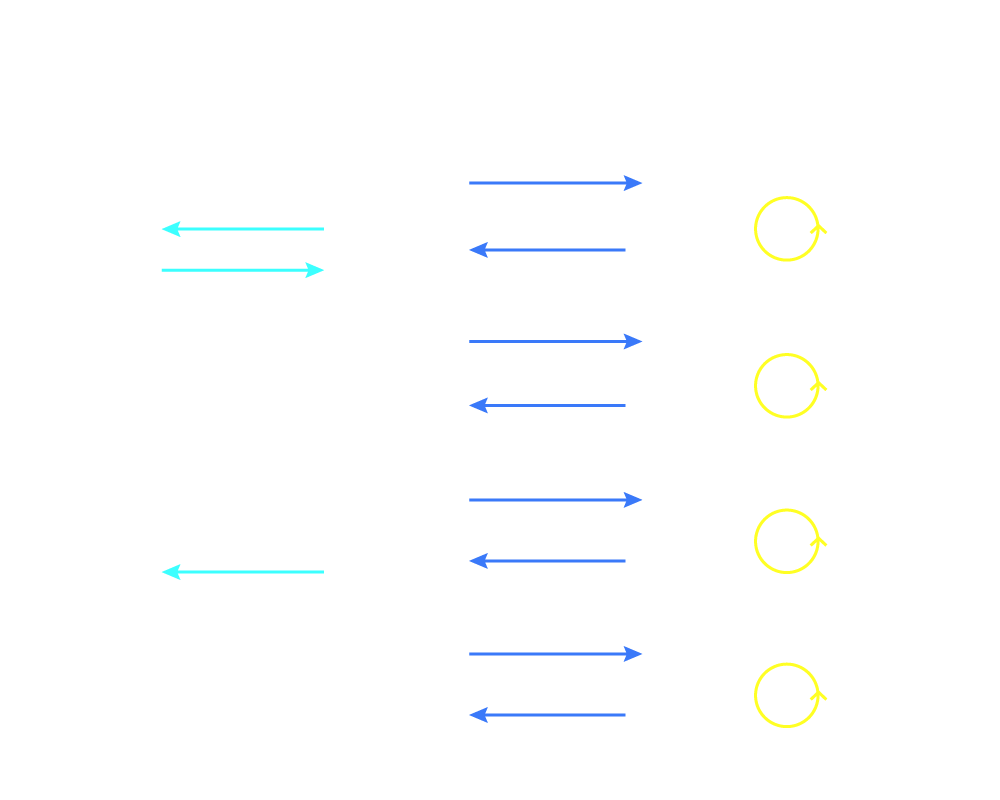
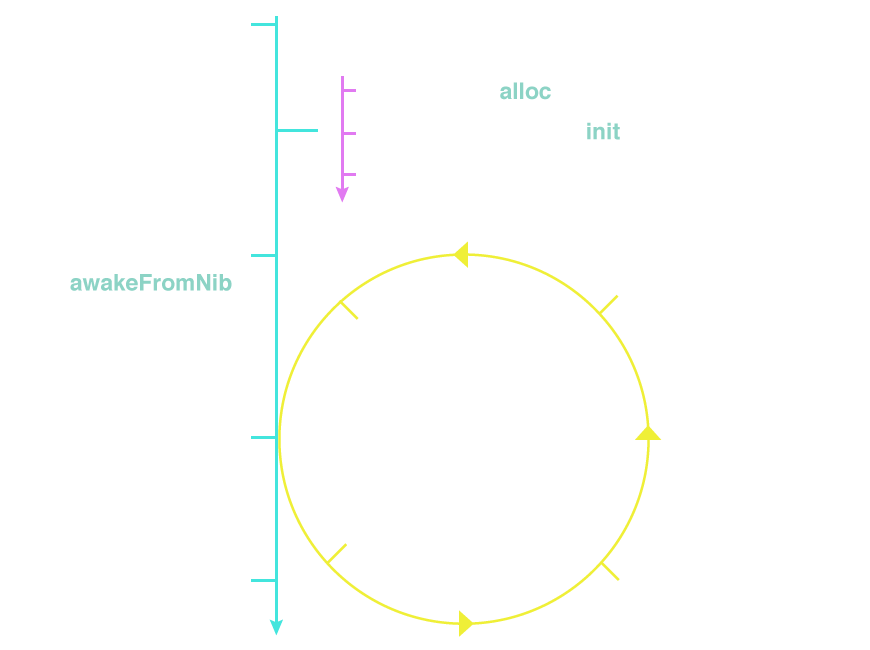
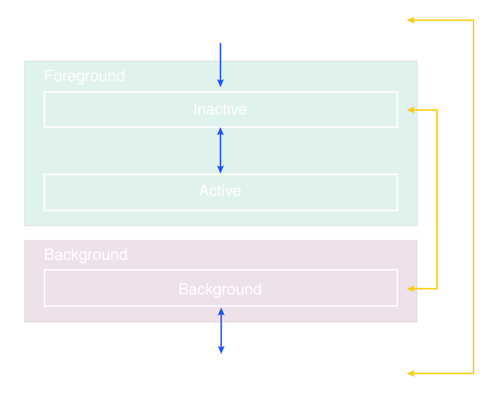

# iOS Overview

<slide>
# iOS Architecture

 

</slide>

<slide>
## NeXt

 

</slide>

<slide>
## OSX 

 

</slide>

<slide>
## Kernel & Services

 

</slide>

<slide>
## Windows & Event System

 

</slide>

<slide>
## Application RunLoop

 

</slide>

<slide>
## Application States

 

</slide>

<slide>
## RubyMotion Stack

 

</slide>

<slide>
# iOS Architecture

 

</slide>
