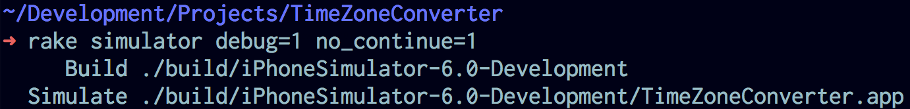
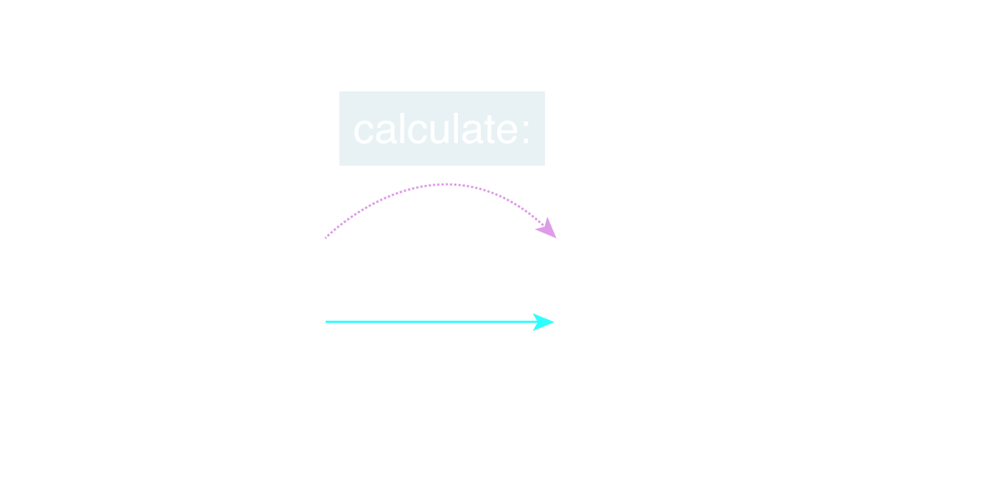
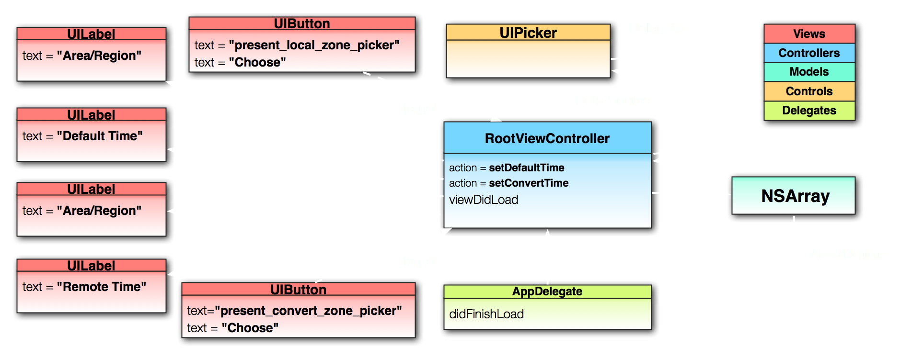

# First Application

<slide>
# First App

 

</slide>

<slide>
## Time Zone Converter

 

</slide>

<slide>
## Motion command

 

</slide>

<slide>
## Create a new project

 

</slide>

<slide>
## Project Structure

 

</slide>

<slide>
## Rake Options

 

</slide>

<slide>
## Rake Configuration

 

</slide>

<slide>
## Rake File

 

</slide>

<slide>
## Running the App

 

</slide>

<slide>
## Debugging the App

 
 

</slide>

<slide>
## MVC/MVP

 

</slide>

<slide>
## Making Connections

 

</slide>

<slide>
## Object Diagram

 

</slide>

<slide>
# First App

 

</slide>
