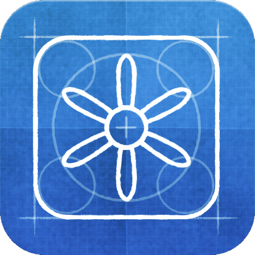
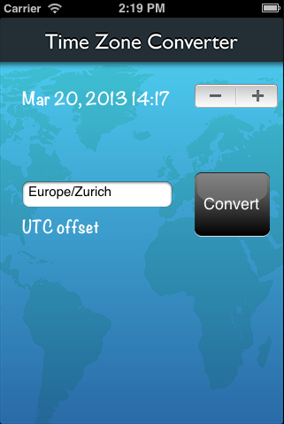
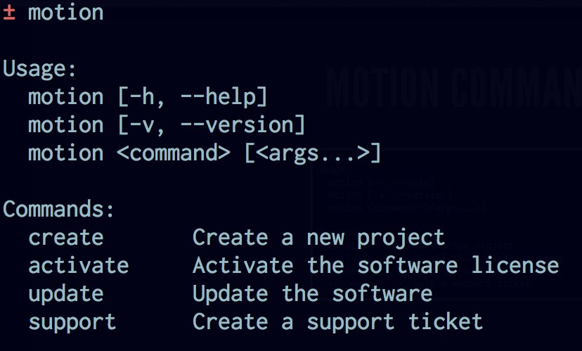
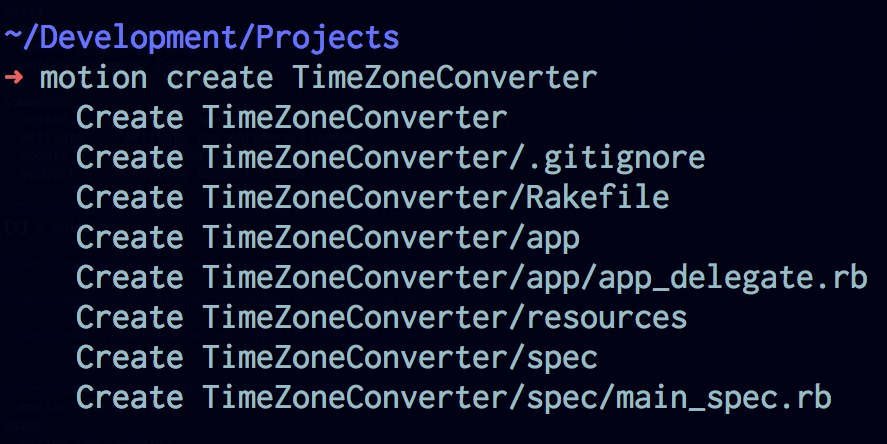
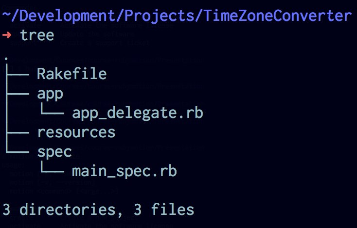
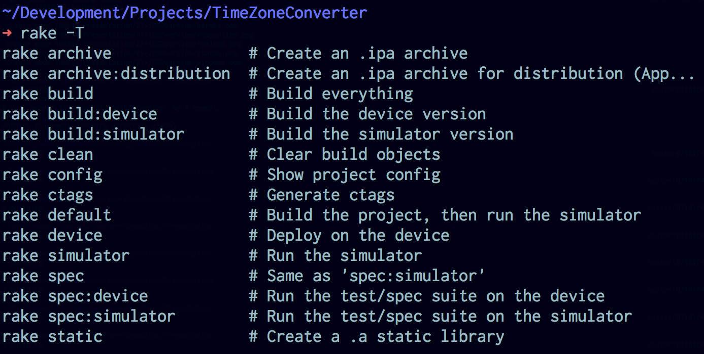
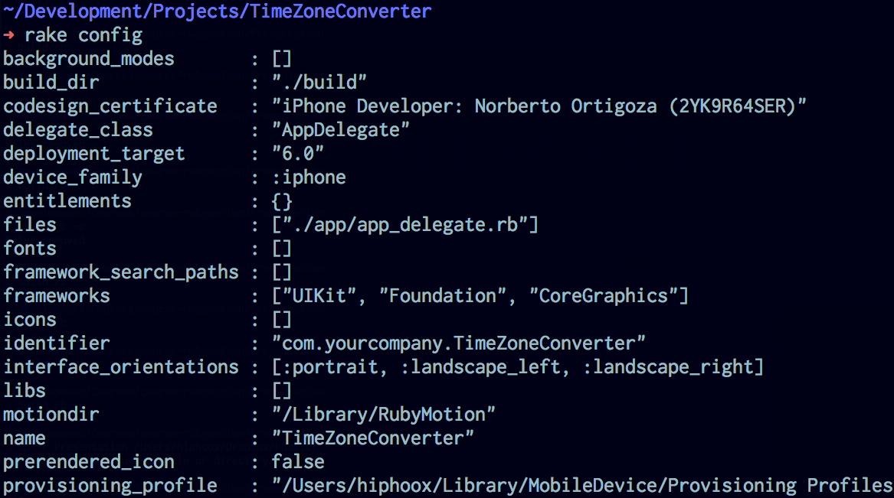
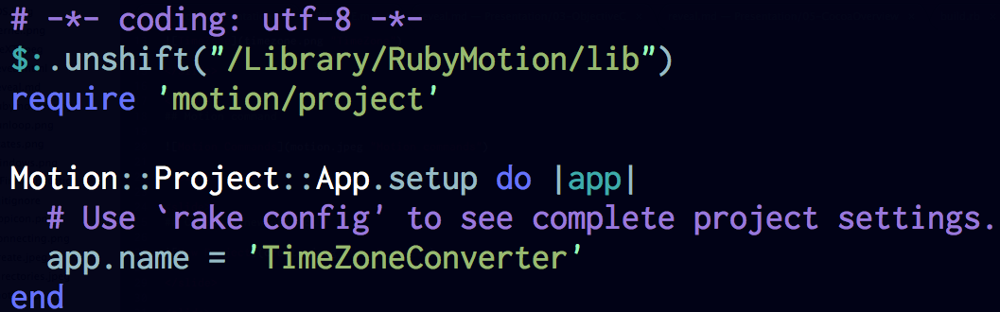
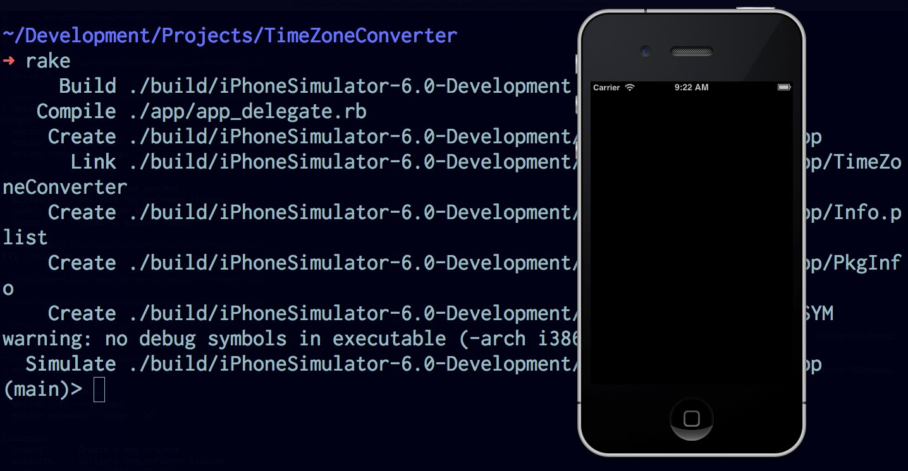
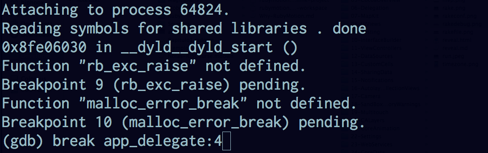

# First Application

<slide>
# First App

 

</slide>

<slide>
## Time Zone Converter

 

</slide>

<slide>
## Motion command

 

</slide>

<slide>
## Create a new project

 

</slide>

<slide>
## Project Structure

 

</slide>

<slide>
## Rake Options

 

</slide>

<slide>
## Rake Configuration

 

</slide>

<slide>
## Rake File

 

</slide>

<slide>
## Running the App

You can use: sessions and repl() methods to interact with objects

 

</slide>

<slide>
## Debugging the App

 
 

</slide>

<slide>
## Deploying an Application

The rake task ***archive:distribution*** will create a binary ready for distribution

</slide>

<slide>
## Object Diagram

 

</slide>

<slide>
# First App

 

[Chapters](../reveal.html) | 
[Objective C](../03-ObjectiveC/reveal.html)

</slide>
