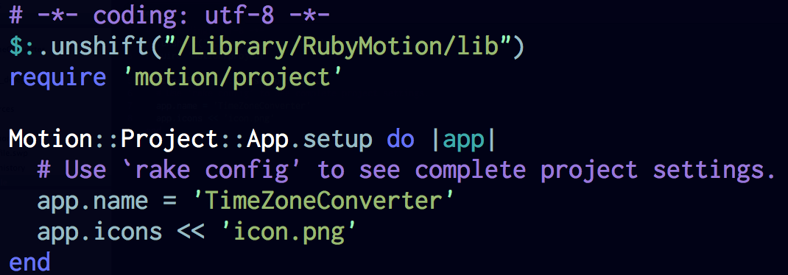
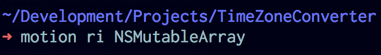
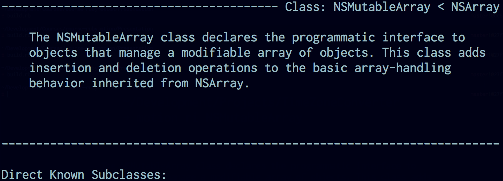

# First Application

<slide>
# First App

 

</slide>

<slide>
## Time Zone Converter

 

</slide>

<slide>
## Tools

1. motion
2. REPL (simulator)
3. rake
4. gdb	(simulator & device)
5. Instruments (out of scope for this class)

</slide>

<slide>
## Motion command

 

</slide>

<slide>
## Create a new project

 

</slide>

<slide>
## Project Structure

 

</slide>

<slide>
## Rake Options

 

</slide>

<slide>
## Rake Configuration

 

</slide>

<slide>
## Rake File

 

</slide>

<slide>
## Running the App

 

</slide>

<slide>
## Debugging the App

 
 

</slide>

<slide>
## Documentation

 
 

</slide>

<slide>
## Deploying an Application

The rake task ***archive:distribution*** will create a binary ready for distribution

What do you need?

* Apple Certificate
* Developer Certificate
* App ID
* Device ID
* Profile

</slide>

<slide>
# First App

 

[Chapters](../reveal.html) | 
[Objective C](../03-ObjectiveC/reveal.html)

</slide>
