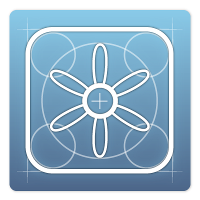

# iOS First Application

<slide>
# The Application

 

</slide>

<slide>
## TimeZone

 

</slide>

<slide>
## Motion command

 

</slide>

<slide>
## Create a new project

 

</slide>

<slide>
## Project Structure

 

</slide>

<slide>
## MVC/MVP

 

</slide>

<slide>
## Simulator

 

</slide>

<slide>
## Object Diagram

 

</slide>

<slide>
## Making Connections

 

</slide>

