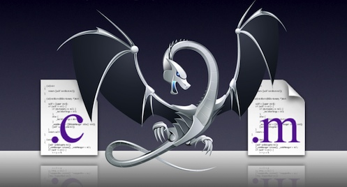

# Objective-C Language

<slide>
# Objective-C

 

</slide>

<slide>
## Language 
        
You will learn the Objective-C language and its object-oriented capabilities.
        
+ <b>Objective-C is a superset of C:</b> Any valid C code will compile as Objective-C.
+ <b>Keywords:</b> To avoid conflicts with C, any new keyword added to Objective-C begins with the @ character, such as <i>@interface</i> and <i>@selector</i>.
        
</slide>
    
<slide>
## Messages & Methods

*Message*

Request sent to an object. Call and object's method

*Method*

A function attached to a class

    [anObject doSomething];

    [anObject setAttribute: newAttribute];

</slide>

<slide>
## Message Structure

 

</slide>

<slide>
## Nested Messages
        
Messages always enclose the receiver and the selector inside a pair of square brackets. These brackets can be nested.
        
    // The alloc method returns a pointer to a newly created instance:
    id dateInstance = [NSDate alloc];

    // Date is not ready to be used yet - it needs to be initialized:
    dateInstance = [dateInstance init];

    // These two messages can be combined into a common idiom:
    id dateInstance = [[NSDate alloc] init];

***id*** is a pointer to any object type.

</slide>

<slide>
## Multiple Arguments

Messages can have zero, one, or more arguments.
        
    // Zero arguments:
    [@"A String" length];      // @selector(length)

    // One argument:
    [@"A String" characterAtIndex:3];  // @selector(characterAtIndex:)

    // Two arguments:
    [anArray setObject:@"Hello" atIndex:index];     
    //@Selector(setObject:atIndex:)

    // Common formatting for multiple argument messages:
    [anArray setObject:@"Hello" 
               atIndex:index];

</slide>

<slide>
## Messages to nil
        
In Ruby, sending a message to the ***nil*** object is an error.
        
In Objective-C it is perfectly legal!
        

     NSString *aString = nil;
     [aString doSomething];     // Nothing happens -- no error
     
    
     NSString *anotherString = [obj copy];
     // anotherString will be nil
     
     
     int count = [anotherString size];
     // count will be zero
        

</slide>

<slide>
## Common Objective-C classes

+ NSString
+ NSMutableString
+ NSArray
+ NSMutableArray
+ NSSet
+ NSMutableSet
+ NSDictionary
* NSMutableDictionary

</slide>

<slide>
## NSString
          
NSString is a class provided to you by the Foundation framework.

     // Constant literal NSString shortcut:
     NSString *myStr = @"Hello ObjC students";
     
     
     // NSStrings are immutable:
     NSString *emptyString = [[NSString alloc] init];   // Stuck with empty string!

    // Create one from another:
    NSString *str = [NSString stringWithFormat:@"I love the number %d", 7];

    // %-tokens are the same as in printf C-function.

</slide>

<slide>
## NSString Operations

    // Concatenate two strings:
    NSString *one = @"Hello ";
    NSString *two = @"world!";
    NSString *three = [one stringByAppendingString:two];    
    // one and two are unchanged

    // Divide a string:
    NSString *list = @"Foo, Bar, Baz";
    NSArray *items = [list componentsSeparatedByString:@", "];

</slide>

<slide>
## Comparing NSStrings

    // Remember: references to objects are pointers:
    NSString *moon = @"The moon";
    NSString *cheese = [NSString stringWithString:@"Cheese"];

    if (moon == cheese) {
        // You will never get here! Pointer comparison!
    }

    if ([moon isEqualToString:cheese]) {
        // You may get here one day...
    }

</slide>

<slide>
## NSLog

Useful for simple debugging and sanity checks.
The ***%@*** token converts an object to a string representation.

    NSDate *now = [NSDate date];
    NSLog(@"The date is %@", now);

    // Console output:
    2011-10-10 17:59:05.498 date[40893:707] The date is 2011-10-10 22:59:05 +0000

    // String representation is given by -description method.

</slide>

<slide>
## Arrays in Objective-C

An <b>NSArray</b> instance is just a list of pointers to objects.
You may think about it as an ordered list of <b>id</b>'s.
     
    // Create an array from other objects:
    Foo *foo = ...;
    Bar *bar = ...;
    Baz *baz = ...;

    NSArray *listOfStuff = [NSArray arrayWithObjects:foo, bar, baz, nil];
    // nil marks the end (a *fenced* list).

    for (NSUInteger i=0; i&lt;[listOfStuff count]; i++) {
        NSLog(@"Item at index %d is %@", i, [listOfStuff objectAtIndex:i]);
    } 
</slide>

<slide>
## NSMutableArray

<b>NSArray</b> is immutable. Once you create one it can't be modified.
<b>NSMutableArray</b> is a mutable subclass of <b>NSArray</b>.
        
    // Create an array from other objects:
    Foo *foo = ...;
    Bar *bar = ...;
    Baz *baz = ...;

    NSMutableArray *listOfStuff = [NSMutableArray array];   // Empty
    [listOfStuff addObject:foo];
    [listOfStuff addObject:baz];
    [listOfStuff insertObject:bar atIndex:1];

    [listOfStuff removeObjectAtIndex:2];
    [listOfStuff removeAllObjects];     // Empty again!

</slide>

<slide>
## Sorting Arrays
             
    // Method of NSMutableArray:
    - (void)sortUsingDescriptors:(NSArray *)sortDescriptors;
        
      
</slide>
    
<slide>
## Descriptors 
        
    NSSortDescriptor *lastNameSD, *firstNameSD, *zipSD;

    lastNameSD = [NSSortDescriptor sortDescriptorWithKey:@"lastName" 
                                               ascending:YES];
                                                                 
    firstNameSD = [NSSortDescriptor sortDescriptorWithKey:@"firstName" 
                                                ascending:YES];
                                                                  
    zipSD = [NSSortDescriptor sortDescriptorWithKey:@"zipCode" 
                                          ascending:YES];

    [employees sortUsingDescriptors:[NSArray arrayWithObjects:lastNameSD,
                                                              firstNameSD, 
                                                              zipSD, 
                                                              nil]];

    // lastName, firstName, and zipCode are ivars of Employee.
        
        
</slide>
    
    
<slide>
## Filtering Arrays
              
    // Method of NSMutableArray:
    - (void)filterUsingPredicate:(NSPredicate *)predicate;

    // Method of NSArray, returns a new array:
    - (NSArray *)filteredArrayUsingPredicate:(NSPredicate *)predicate;

    // Predicates are SQL-like logical operators:
    NSPredicate *predicate = 
            [NSPredicate predicateWithFormat:@"(lastName like[c] %@) AND (birthday > %@)",
                            lastNameSearchString, birthdaySearchDate];

    // Predicates can refer to ivars by name or use keypaths: foo.bar.lastName
        
        
</slide>
    
    
<slide>
## NSSet and NSMutableSet
  
<b>Sets</b> are collections with no order and objects can be present only once. Useful when dealing with membership issues -- is the object in there?
                
    // Create a set:
    + (id)setWithArray:(NSArray *)elements;
    + (id)setWithObjects:(id)firstObj ...;
    + (id)set;  // Useful in NSMutableSet case

    // Use the set:
    - (NSUInteger)count;    // How many elements in the set?
    - (BOOL)containsObject:(id)anObject;    // Is it in there?

    // ComparingSets:
    - (BOOL)isEqualToSet:(NSSet *)aSet;
    - (BOOL)isSubsetOfSet:(NSSet *)aSet;
    - (BOOL)intersectsSet:(NSSet *)aSet;
        
</slide>
    
<slide>
## NSMutableSet Methods
        
    // Methods in NSMutableSet - they modify the receiver:
    - (void)unionSet:(NSSet *)aSet;
    - (void)minusSet:(NSSet *)aSet;
    - (void)intersectSet:(NSSet *)aSet;
        
</slide>
    
<slide>
## NSDictionary and NSMutableDictionary
        
Dictionaries are unordered and associate a <b>key</b> with a <b>value</b>.
The key can be any object that is copiable and unique within the collection. Typically, they are constant strings.
                
    // Create a dictionary:
    NSDictionary *dict = [NSDictionary dictionaryWithObjectsAndKeys:
                        @"value1", @"key1", @"value2", @"key2", nil];
                        
    // Create a mutableDictionary:
    NSMutableDictionary *mDict = [NSMutableDictionary dictionary];

    [mDict setObject:foo forKey:@"fooInstance"];
    id obj = [dict objectForKey:@"key2"];
    [mDict removeObjectForKey:@"foo"];
    [mDict removeAllObjects];
        
</slide>

<slide>
## NSNull
        
A collection cannot have a "hole" or nil value. But you can use <b>NSNull</b> as a placeholder.
        
    // -null returns the singleton instance of NSNull:
    - (NSNull *)null;

    NSMutableArray *array = [[NSMutableArray alloc] init];

    // Add the placeholder:
    [array addObject:[NSNull null]];

    // Because null is a singleton, we can make direct comparisons:
    if ([array objectAtIndex:0] == [NSNull null]) {
        // Do something
    }
</slide>

<slide>
## Constants 
        
Objective-C programmers use global variables frequently. Often for defining keys.
        
    // In Constants.h:
    extern NSString const *kItemCode;

    // Elsewhere, but only one place (Constants.m perhaps):
    NSString const *kItemCode = @"keyItemCode";

    // Wherever the key is used:
    #import "Constants.h"

    [dict setObject:code forKey:kItemCode];

    // kItemCode is better than @"keyItemCode" because if
    // you misstype it, the compiler will not warn you
    // in the latter case.
        
</slide>

<slide>
## Interface and Implementation
        
<b>Interface</b>: Declare your intentions. It is called an interface because just like in a real-life object it specifies how the user can interact with it (buttons and dials). <b>header (.h)</b> file.

+ Declare instance variables (data)
+ Declare properties (data/behavior)
+ Declare methods (behavior)

<b>Implementation</b>: Make it work. Define methods. <b>implementation (.m)</b> file.        

</slide>

<slide>
## Interface

    @interface Customer : NSObject {
       NSString *firstName;
       NSString *lastName;
    }

    - (NSString*) firstName;
    - (void)setName:(NSString*) aFirstName;
    - (void)setLastName:(NSString*) aLastName;
    - (void)setName:(NSString*) aFirstName andLastName:(NSString*) aLastName;

    @end 
   
Objective-C only supports <i>single inheritance</i>. You can only inherit from one superclass at a time.
 
</slide>

<slide>
## Implementation

    @implementation Customer

    - (void)setName:(NSString*) aFirstName andLastName:(NSString*) aLastName;
    {
        [self setName: aFirstName];
        [self setLastName: aLastName];
    }

    @end
    
</slide>

<slide>
## Accessor Methods
        
Object-oriented dogma tells us that instance variables should not be accessed directly by others. Also, there may be other side-effects that you want to happen when an instance variable is changed. To this end, you implement <b>accessor methods</b>.

+ Instance variable named foo
+ Getter method: gets the value of an instance variable - named <b>foo</b>
+ Setter method: sets the value of an instance variable - named <b>setFoo:</b>

The naming convention is important! You <b>will</b> break things if you don't follow it.

</slide>
   
<slide>
## Implementing Accessor Methods 1
        
     @interface Froozler : NSObject
    {
        double blurbleeflox;
    }

    - (void)setBlurbleeflox:(double)newBlurbleeflox;
    - (double)blurbleeflox;

    @end
        
</slide>

<slide>
## Implementing Accessor Methods 2
        
    @implementation Froozler
                
    - (void)setBlurbleeflox:newBlurbleeflox
    {
        blurbleeflox = newBlurbleeflox;
    }

    - (double)blurbleeflox
    {
        return blurbleeflox;
    }
                
    @end
            
</slide>
    
<slide>
## Properties
        
Writing accessors is boring. Anything boring tends to be error-prone.
        
    // Beat the boredom, use properties!

    @interface Froozler : NSObject
    {
        double blurbleeflox;    // The ivar declaration is optional
    }
    @property double blurbleeflox;

    // In the implementation:

    @implementation Froozler

    @synthesize blurbleeflox;   // Accessors are written for you!

    @end
        
</slide>
    
<slide>
## Self
        
Inside methods, you have an implicit local variable called <b>self</b>. <b>self</b> is a pointer to the current instance of the class.
You can use <b>self</b> to send messages to the same instance.
        
    - (double)doThatThingYouDo
    {
        float temp = [self calculateThatStuff];
        return temp * 123.0;
    }
        
</slide>

<slide>
## Super
        
What if you want to explicitly invoke a method from a superclass? This is frequently done when you want to extend a parent's method.
        
    @implementation MyClass

    // calculateThatThing is overriden!
    // How do you get a hold of the old code?
    - (float) calculateThatThing
    {
        float result = [super calculateThatThing];
        return result * [self correctionFactor];
    }

    @end

</slide>

<slide>
## Protocols
        
A <b>protocol</b> is a contract. It is a promise to the compiler that a given class will implement an given <b>interface</b>. An interface is a series of methods that provide a certain role or behavior.
        
Delegates or helper objects are expected to behave in a certain way. A protocol is a way to enforce that behavior.
        
</slide>
    
<slide>
## Protocol Example
        
    @protocol EspressoMachineDelegate <NSObject>
    // This protocol inherits from NSObject. Delegate class
    // must also implement methods required for NSObject.

    @required
    - (void)machineWillRequireCoffeeGrounds;
    - (void)machineWillRequireCleaning;

    @optional
    - (void)machineDidMakeEspresso;
    - (void)machileWillFoamMilk;

    @end
        
</slide>
    
<slide>
## Conforming to a Protocol
        
    @interface MyEspressoDelegate : NSObject <EspressoMachineDelegate>
    {
        //Ivars
    }

    // Properties and methods.

    @end
        
</slide>

<slide>
## Compiler Hints
        
Sometimes you want to tell the compiler an object implements methods listed in a protocol
        
    id <EspressoMachineDelegate> delegate = [controller espressoDelegate];

    // Now the compiler knows that delegate implements certain methods:
    [delegate machineWillFoamMilk];

</slide>

<slide>
## Categories
        
Wouldn't it be neat if NSString had a <i>insert your wish here</i> method?
        
    // In NSString+VowelCounting.h:
    #import <Foundation/Foundation>

    @interface NSString (VowelCounting)
    - (int)vowelCount;
    @end

    // In NSString+VowelCounting.m:
    @implementation NSString (VowelCounting)
    - (int)vowelCount
    {
        // Will implement in exercise!
    }
    @end
        
</slide>
        
<slide>
## Class Extensions
        
    // Want to hide stuff from the header?
    // Put it in the implementation!

    @interface MyClass ()

    - (void)doSomething;
    @property (copy) NSMutableString *name;
    int count;

    @end

    @implementation MyClass

    // Implement!

    @end
        
</slide>

<slide>
# Excercise

 

</slide>

<slide>
# Objective-C

 

</slide>
