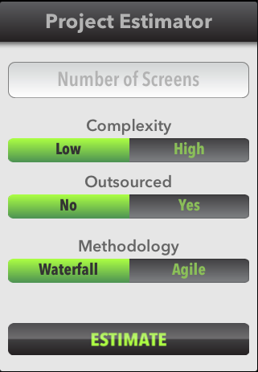
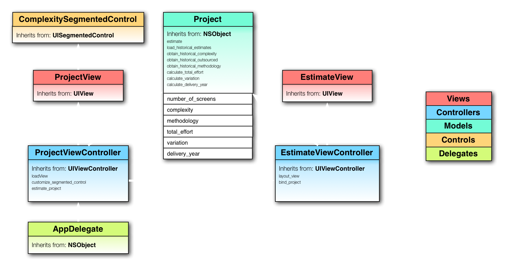

# Objective-C Language

<slide>
# Objective-C & Ruby

 

</slide>

<slide>
## Project Estimator

 

</slide>

<slide>
## Objective-C 
                
+ ***Objective-C*** is an object-oriented flavor of ***C*** that has been, like ***Ruby***, heavily influenced by the ***Smalltalk*** language.
+ Any valid ***C*** code will compile as ***Objective-C***.
+ All the keywords added by ***Objective-C*** begins with the ***@*** character, such as <i>@interface</i> and <i>@selector</i>.
+ Method names use named parameters. 
+ ***Objective-C*** uses camel case naming convention    
+ ***Objective-C*** supports static and dynamic binding

</slide>

<slide>
## RubyMotion language 
                
+ ***RubyMotion*** use a modified version of the ***Ruby 1.9*** language. 
+ ***RubyMotion*** adds named parameters similar to Ruby 2.0 
+ It doesn't support the ***require*** and  ***eval*** methods.
+ It is a compiled version of the Ruby language
+ ***RubyMotion*** lets you send and define ***Objective-C*** messages. 
+ ***Objective-C*** & ***Ruby*** have the notion of open classes, single inheritance and single dynamic message dispatch.

</slide>

<slide>
## RubyMotion Object Model

+ ***RubyMotion*** implements the ***Ruby*** object model by using the ***Objective-C*** runtime and Foundation libraries. Which are the base of the iOS SDK.
+ In ***RubyMotion***, Ruby classes, methods and objects are ***Objective-C*** classes, methods and objects respectively. 
+ The converse is also true. ***Objective-C*** classes, methods and objects are available in ***Ruby*** as if they were native.

</slide>
    
<slide>
## Objective-C Message Structure

 

</slide>

<slide>
## Objective-C <-> Ruby

Messages can have zero, one, or more arguments.

Objective-C

    // Zero arguments
    [anObject doSomething];

    // One argument
    [anObject setAttribute: newAttribute];

    // Two arguments. Common formatting for multiple argument messages:
    [anArray setObject:@"Hello" 
               atIndex:index];

RubyMotion

    anObject.doSomething # or anObject.doSomething()
    anObject.setAttribute(newAttribute)
    anArray.setObject("Hello", atIndex:index)     

</slide>

<slide>
## Nested Messages
        
Messages always enclose the receiver and the selector inside a pair of square brackets. These brackets can be nested.
        
    // The alloc method returns a pointer to a newly created instance:
    id dateInstance = [NSDate alloc];

    // Date is not ready to be used yet - it needs to be initialized:
    dateInstance = [dateInstance init];

    // These two messages can be combined into a common idiom:
    id dateInstance = [[NSDate alloc] init];

***id*** is a pointer to any object type.
  
    # Ruby
    dateInstance = NSDate.alloc.init

</slide>

<slide>
## Defining Objective-C style messages

***Objective-C*** messages can also be defined in ***RubyMotion***.

    class DrawingProxy
      def drawAtPoint(point, withFont:font)
        @str.drawAtPoint(point, withFont:font)
      end
    end

*The syntax used to define ***Objective-C*** selectors was added to ***RubyMotion*** and is not part of the Ruby standard.*

</slide>

<slide>
## Objective-C and Ruby classes

You can invoke ***Objective-C*** or ***Ruby*** methods against built-in classes.

    'hello'.uppercaseString    # uppercaseString is a NSString instance method

    'hello'.upcase             # upcase is a normal String instance method

    [1, 2, 3].objectAtIndex(1) # objectAtindex is a NSArray instance method

    [1, 2, 3].send(:objectAtIndex, 1) # using Ruby's metaprogramming features 

    [1, 2, 3].send(:'objectAtIndex:', 1) # selector name from Objective-C 

    [1, 2, 3].[1]               # [] is the Ruby way!

</slide>

<slide>
## Memory Management

+ ***RubyMotion*** provides automatic memory management; you do not need to reclaim unused objects.
+ ***RubyMotion*** implements a form of garbage collection called reference counting. 
+ An object has an initial reference count of zero, is incremented when a reference to it is created and decremented when a reference is destroyed. When the count reaches zero, the object’s memory is reclaimed by the collector.

</slide>

<slide>
## Selector shorcuts

The ***RubyMotion*** runtime provides convenience shortcuts for certain Objective-C selectors.

    1. setFoo:           =>   foo=    
    2. isFoo             =>   foo?    
    3. objectForKey:     =>    []     
    4. setObject:forKey: =>    []=   

</slide>

<slide>
## Common Objective-C classes

+ NSString
+ NSMutableString
+ NSArray
+ NSMutableArray
+ NSSet
+ NSMutableSet
+ NSDictionary
* NSMutableDictionary

</slide>

<slide>
## NSString    (String)
          
NSString is a class provided to you by the Foundation framework.

Objective-C

    // Constant literal NSString shortcut:
    NSString *myStr = @"Hello ObjC students";

Ruby

    my_string = "Hello Ruby students"   # this one in mutable!
     
    # NSStrings are immutable. Stuck with empty string!
    empty_string = NSString.alloc.init

    # Create one from another:
    # TIP: this does not work in RM!
    str = NSString.stringWithFormat("I love number %d", 7) 

</slide>

<slide>
## NSString Operations

    # Concatenate two strings. one and two are unchanged
    one = "Hello "
    two = "world!"
    three = one.stringByAppendingString(two) 

    # Divide a string:
    list = "Foo, Bar, Baz"
    items = list.componentsSeparatedByString(", ")

</slide>

<slide>
## NSArray and NSMutableArray   (Array)

<b>NSArray</b> is immutable. Once you create one it can't be modified.
<b>NSMutableArray</b> is a mutable subclass of <b>NSArray</b>.

    # TIP: this does not work in the REPL!
    list_of_stuff = NSArray.arrayWithObjects(foo, bar, baz, nil)
    # nil marks the end (a *fenced* list).

    listOfStuff = NSMutableArray.array   // Empty
    listOfStuff.addObject(foo)
    listOfStuff.addObject baz
    listOfStuff.insertObject bar, atIndex:1

    listOfStuff.removeObjectAtIndex 1
    listOfStuff.removeAllObjects     // Empty again!

</slide>

<slide>
## NSSet and NSMutableSet
  
<b>Sets</b> are collections with no order and objects can be present only once. Useful when dealing with membership issues -- is the object in there?
                
    # Create a set:
    a_set = NSSet.setWithArray [1,2,3]
    a_set = NSSet.setWithObjects(firstObj, ...)
    another_set = NSSet.set  // Useful in NSMutableSet case

    # Use the set:
    a_set.count    // How many elements in the set?
    a_set.containsObject 4    // Is it in there?

    # ComparingSets:
    a_set.isEqualToSet another_set
    a_set.isSubsetOfSet another_set
    a_set.intersectsSet another_set
        
</slide>
    
<slide>
## NSMutableSet Methods
        
    # Methods in NSMutableSet - they modify the receiver:
    a_set = NSMutableSet.setWithArray [1,2,3]

    a_set.unionSet another_set
    a_set.minusSet another_set
    a_set.intersectSet another_set
        
</slide>
    
<slide>
## NSDictionary and NSMutableDictionary   (Hash)
        
Dictionaries are unordered and associate a <b>key</b> with a <b>value</b>.
The key can be any object that is copiable and unique within the collection. Typically, they are constant strings.
                
    # Create a dictionary.
    # It does not work in the REPL!
    dict = NSDictionary.dictionaryWithObjectsAndKeys("value1", "key1", "value2", "key2", nil)
                        
    # Create a mutableDictionary:
    mDict = NSMutableDictionary.dictionary

    mDict.setObject(foo, forKey: "fooInstance")
    obj = dict.objectForKey("key2")
    mDict.removeObjectForKey("foo")
    mDict.removeAllObjects
        
</slide>

<slide>
## Constants 
        
***Objective-C*** programmers use global variables frequently. Often for defining keys.
In ***RubyMotion*** these constants are accesible with the first letter as uppercase.

In Objective-C

    // In Constants.h:
    extern NSString const *kItemCode;

    // Elsewhere, but only one place (Constants.m perhaps):
    NSString const *kItemCode = @"keyItemCode";

In Ruby

    # Wherever the key is used. 
    dict.setObject(code forKey: KItemCode)

    # KItemCode is used instead of keyItemCode
        
</slide>

<slide>
## Defining Classes in Objective-C

***Objective-C*** uses the keyword <b>@interface</b> to define a class. <b>header (.h)</b> file.

+ Declare instance variables (data)
+ Declare properties (data/behavior)
+ Declare methods (behavior)

</slide>

<slide>
## Interface

    @interface Customer : NSObject {
       NSString *firstName;
       NSString *lastName;
    }

    - (NSString*) firstName;
    - (void)setName:(NSString*) aFirstName;
    - (void)setLastName:(NSString*) aLastName;
    - (void)setName:(NSString*) aFirstName andLastName:(NSString*) aLastName;

    @end 
   
Objective-C only supports <i>single inheritance</i>. You can only inherit from one superclass at a time.
 
</slide>

<slide>
## Implementation

Make it work. Define methods. <b>implementation (.m)</b> file.        

    @implementation Customer

    - (void)setName:(NSString*) aFirstName andLastName:(NSString*) aLastName;
    {
        [self setName: aFirstName];
        [self setLastName: aLastName];
    }

    @end
    
</slide>

<slide>
## Protocols
        
A <b>protocol</b> is a contract. It is a promise to the compiler that a given class will implement an given <b>interface</b>. 
        
    @protocol EspressoMachineDelegate <NSObject>
    // This protocol inherits from NSObject. Delegate class
    // must also implement methods required for NSObject.

    @required
    - (void)machineWillRequireCoffeeGrounds;
    - (void)machineWillRequireCleaning;

    @optional
    - (void)machineDidMakeEspresso;
    - (void)machileWillFoamMilk;

    @end

In RubyMotion you don't need to do anything special to conform to a Protocol.
        
</slide>
    
<slide>
## Categories
        
You can add methods to an existing class.
        
    // In NSString+VowelCounting.h:
    #import <Foundation/Foundation>
    @interface NSString (VowelCounting)
    - (int)vowelCount;
    @end

    // In NSString+VowelCounting.m:
    @implementation NSString (VowelCounting)
    - (int)vowelCount
    {
        // Implementation goes here
    }
    @end

You can access this methods from ***RubyMotion***

    "Hola Mundo".vowelCount
        
</slide>
        
<slide>
## Object Diagram

 

</slide>

<slide>
# Objective-C

 

[Chapters](../reveal.html) | 
[C Language](../04-CLanguage/reveal.html)

</slide>
