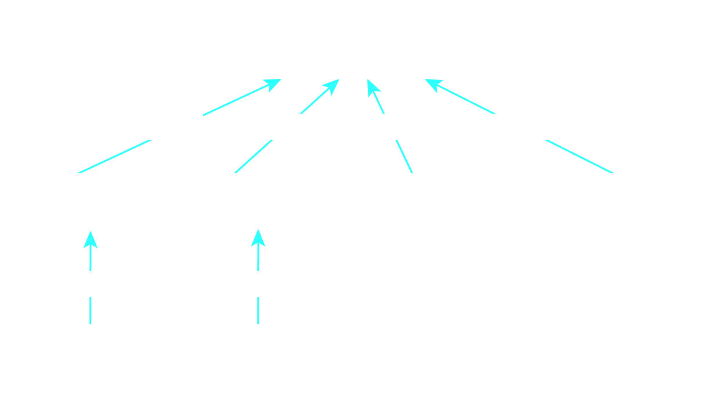
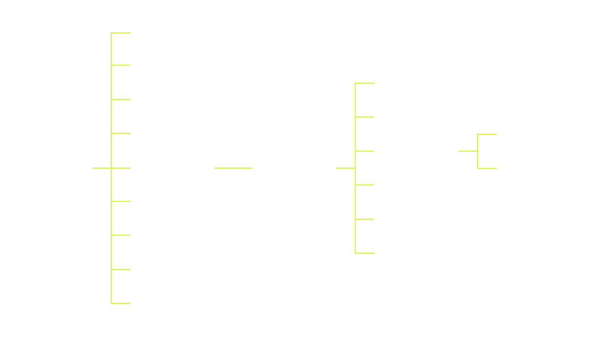
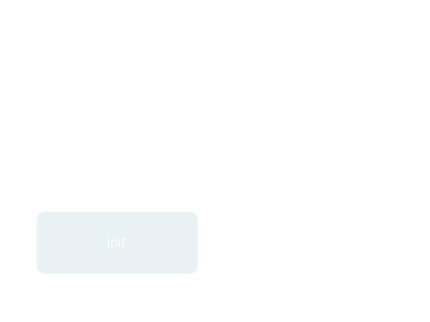

# Cocoa Overview

<slide>
# Cocoa Introduction

 

</slide>

<slide>
## CocoaHeads App

 

</slide>

<slide>
## What is Cocoa Touch? 
        
Cocoa Touch is the igh-level Objective-C programming API for iOS. The ***core*** frameworks included are:
        
+ Foundation framework
  * NSString, NSArray, NSSet, NSDictionary, etc.
+ UIKit Framework
  * UIWindow, UIView, UIButton, etc.
        
</slide>
    
<slide>
## What is a Framework?

A framework is a collection of classes that are intended to be used together. That is, the classes are compiled together into a reusable library of code (static or dynamic). 

Any related headers or resources are put into a directory with the library (images, docs, fonts, etc.).

 

</slide>

<slide>
## Foundation Hierarchy

 

</slide>

<slide>
## UIKit Hierarchy

 

</slide>

<slide>
## Other Frameworks
        
+ CoreData
+ CoreLocation
+ MapKit
+ CoreGraphics
+ GameKit

</slide>

<slide>
## UIApplication

The UIApplication class provides a centralized point of control and coordination for applications running on iOS.
Every application must have exactly one instance of UIApplication

 

</slide>

<slide>
## AppDelegate

 

</slide>

<slide>
## Nib Files
      

</slide>

<slide>
## Initializers

    // Initializers
    - (id)init
    - (id)initWithName:(NSString *)name

+ Objective-C uses init* methods to initilize new instances.
+ A class can have zero o more initializers.
+ One initilizer is the "Designated".
+ All initializers in the same class must call the designated initializer.
+ The designated initilizer must call the superclass's designated initializer.

</slide>

<slide>
## Initializers Chain

 

</slide>

<slide>
## Overwriting Initializers

Sometimes you will need to overwrite the initializer from Ruby

    //  This is now the designated initializer
    def initWithName(name)
      if super.init     // You must call the superclass's designated initializer 
        self.setName(name)
      end
      self
    end      

    // Any other method must call the designated initializer 
    def init
      self.initWithName("Default Name")
    end   

</slide>

<slide>
## ?????

</slide>

<slide>
# Excercise

 

</slide>

<slide>
# Objective-C

 

</slide>
