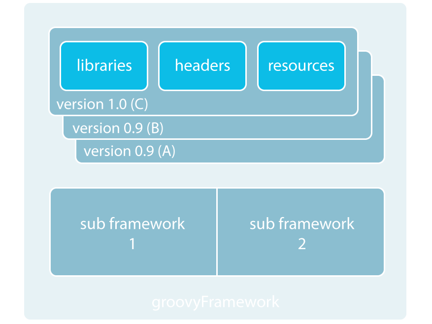
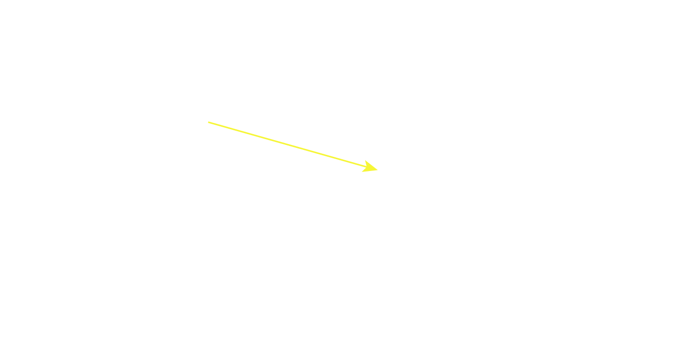
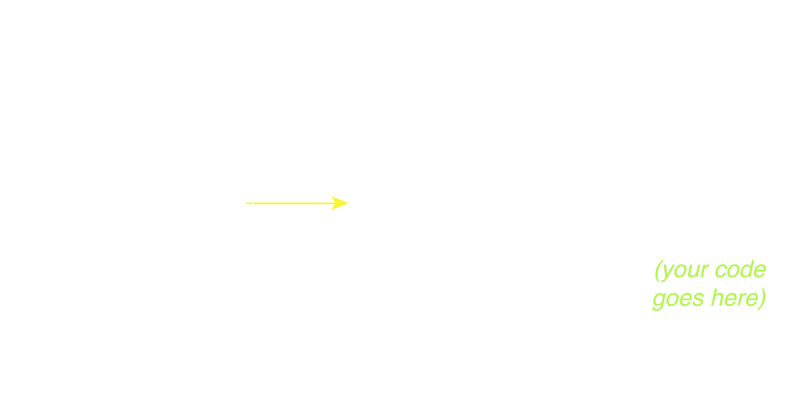

# Cocoa Overview

<slide>
# Cocoa Introduction

 

</slide>

<slide>
## CocoaHeads App

 

</slide>

<slide>
## What is Cocoa Touch? 
        
Cocoa Touch is the high-level Objective-C programming API for iOS. The ***core*** frameworks included are:
        
+ Foundation framework
  * NSString, NSArray, NSSet, NSDictionary, etc.
+ UIKit Framework
  * UIWindow, UIView, UIButton, etc.
        
</slide>
    
<slide>
## What is a Framework?

A framework is a collection of classes that are intended to be used together. That is, the classes are compiled together into a reusable library of code (static or dynamic). 

</slide>

<slide>
Any related headers or resources are put into a directory with the library (images, docs, fonts, etc.).

 

</slide>

<slide>
## Foundation Hierarchy

 

</slide>

<slide>
## UIKit Hierarchy

 

</slide>

<slide>
## Other Frameworks
        
+ CoreData
+ CoreLocation
+ MapKit
+ CoreGraphics
+ GameKit

</slide>

<slide>
## MVC/MVP

 

</slide>

<slide>
##  The Hollywood Principle
    
"Don't call us, we'll call you."
<b>Callbacks</b> are methods or functions that are invoked when something happens.

As RubyMotion programmer you will deal with three types of callbacks:

+ Target-action
+ Delegates 
+ Notifications
    
</slide>

<slide>
## Target-Action
    
 
    
</slide>

<slide>
## Delegates

In CocoaTouch, custom functionality is attached to a class by setting a delegate. The delegate implements the custom functionality.

Methods that the delegate of a given class <i>must</i> or <i>may</i> implement are listed in a <b>protocol</b>. 
    
</slide>

<slide>
## Delegates 
    
 
    
</slide>

<slide>
## Notifications
    
NSNotificationCenter serves as a bulletin board.

An object can become an observer, and every time something specific happens, it will be notified.

An object can post a notification. Any observers for that event will be notified.
    
</slide>

<slide>
## Observing

    # To become an observer:
    NSNotificationCenter.defaultCenter.addObserver(self,
                       selector: 'respondToNotification:',
                           name: 'mynotification',
                         object: nil)

    # This object must implement:
    def respondToNotification(note)
      # My code
    end

    # The method name is variable but the signature is not.

</slide>

<slide>
## Posting

    # Post a notification:
    NSNotificationCenter.defaultCenter.postNotificationName('mynotification', object:self)

    # At this point, any observers to this event will be notified.

</slide>

<slide>
## UIApplication & AppDelegate

The ***UIApplication*** class provides a centralized point of control and coordination for applications running on iOS.
Every application must have exactly one instance of ***UIApplication***

The ***app delegate*** is an object created at app launch time, usually by the ***UIApplicationMain*** function. Its primary job is to handle state transitions within the app. For example, this object is responsible for launch-time initialization.

</slide>

<slide>
RubyMotion uses the default UIApplication instance. You can not change it. 

 

</slide>

<slide>
## Nib Files

A nib file is a data archive that essentially contains a set of freeze-dried objects that you want to recreate at runtime. Nib files are used most commonly to store preconfigured windows, views, and other visually oriented objects but they can also store nonvisual objects such as controllers.     

</slide>

<slide>
## Nib Content 

 

</slide>

<slide>
## Initializers

    # Initializers
    - (id)init
    - (id)initWithName:(NSString *)name

+ Objective-C uses init* methods to initilize new instances.
+ A class can have zero o more initializers.
+ One initilizer is the "Designated".
+ All initializers in the same class must call the designated initializer.
+ The designated initilizer must call the superclass's designated initializer.

</slide>

<slide>
## Initializers Chain

 

</slide>

<slide>
## Overwriting Initializers

Sometimes you will need to overwrite the Objective-C initializers from Ruby

    # This is now the designated initializer
    def initWithName(name)
      if super.init     // You must call the superclass's designated initializer 
        self.setName(name)
      end
      self
    end      

    # Any other method must call the designated initializer 
    def init
      self.initWithName("Default Name")
    end   

</slide>

<slide>
# Cocoa Introduction

 

[Chapters](../reveal.html) | 
[CoreLocation](../06-Delegation/reveal.html)

</slide>
