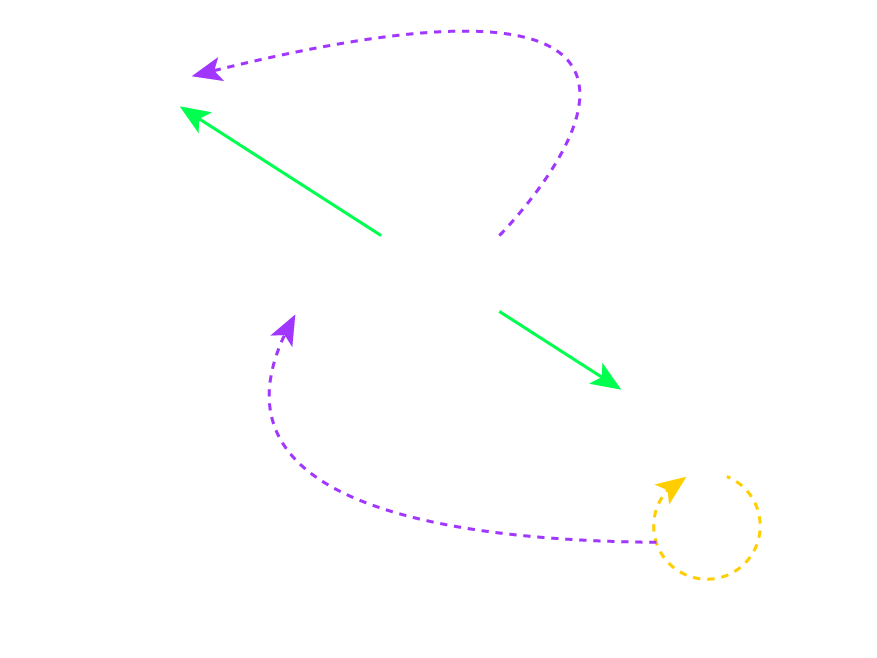

# Delegation

<slide>
# CoreLocation

 

</slide>

<slide>
## CocoaHeads App

 

</slide>

<slide>
## CoreLocation
        
It is a Framework that has a collection of classes to retrieve location of a device using: Wi-Fi, Cell Towers & GPS

Main classes:

+ CLLocationManager
+ CLLocation
        
</slide>
    
<slide>
## Using CLLocationManager
  
    # Configurating CLLocationManager
    locationManager = CLLocationManager.alloc.init
    locationManager.setDistanceFilter(0.0)
    locationManager.setDesiredAccuracy(KCLLocationAccuracyBest) // Don't forget K is uppercase
    locationManager.setDelegate(self)
    locationManager.startUpdatingLocation   //It is an asynchronous call

    # Another Accuracy values:
    KCLLocationAccuracyBest
    KCLLocationAccuracyNearestTenMeters
    KCLLocationAccuracyHundredMeters
    KCLLocationAccuracyKilometer
    KCLLocationAccuracyThreeKilometers

</slide>

<slide>
## Callback method

    locationManager.setDelegate(controller) // Our controller 

    # In our controller:
    def locationManager(manager, didUpdateToLocation:newLocation, 
                                        fromLocation:oldLocation)   
        # Your code goes here
    end

</slide>

<slide>
## CoreLocation Protocol

    @protocol CLLocationManagerDelegate<NSObject>
    @optional
    - (void)locationManager:(CLLocationManager *)manager
      didUpdateToLocation:(CLLocation *)newLocation
      fromLocation:(CLLocation *)oldLocation;
        
    - (void)locationManager:(CLLocationManager *)manager
           didUpdateHeading:(CLHeading *)newHeading;

    - (BOOL)locationManagerShouldDisplayHeadingCalibration:(CLLocationManager *)manager;

    - (void)locationManager:(CLLocationManager *)manager
      didFailWithError:(NSError *)error;
    @end

</slide>

<slide>
## Final Configuration

 

</slide>

<slide>
# CoreLocation

 

[Chapters](../reveal.html) | 
[MapKit](../07-MapKit/reveal.html)

</slide>
