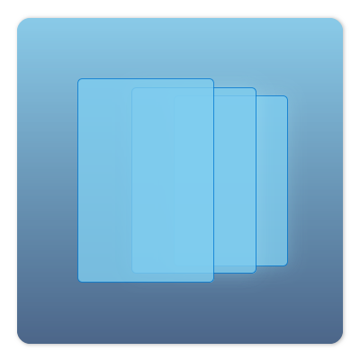
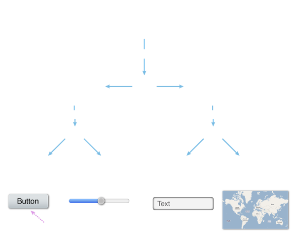
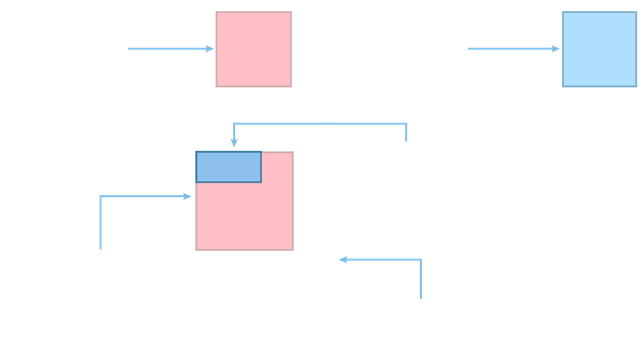
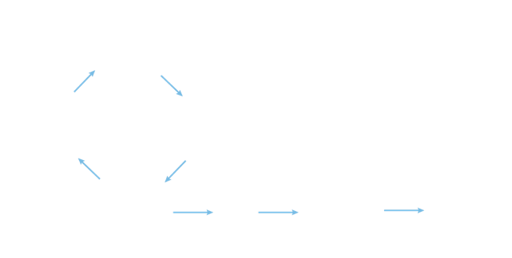
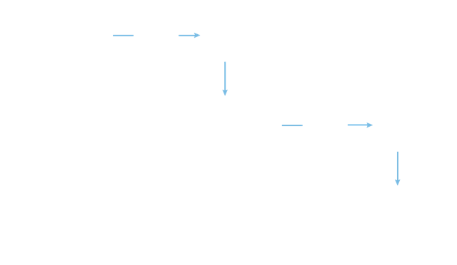
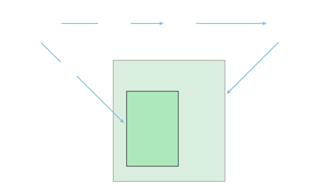

# UIViews

<slide>
## UIViews

 

</slide>

<slide>
## CocoaHeads App

 

</slide>

<slide>
## UIViews
        
UIViews are responsible for:

+ Knowing how to draw themself
+ Knowing its subviews
+ Accepting interaction
        
</slide>
    
<slide>
## UIView Hierarchy

 

</slide>

<slide>
## Creating UIViews

You can create them from InterfaceBuilder or:

    myView = UIView.alloc.initWithFrame(CGRectMake(0,0,30,30))
    window.addSubview(myView)

</slide>

<slide>
## Frames & Bounds

 

</slide>

<slide>
## UIView's Drawing Cycle

 

</slide>

<slide>
## UIView's Drawing

For drawing you use Core Graphics. It is a 2D C API Library.

    # Subclassing UIView
    class MyView < UIView

      def drawRect(rect)
        ctx = UIGraphicsGetCurrentContext()
        bounds = self.bounds
        
        CGContextMoveToPoint(ctx, bounds.origin.x, bounds.origin.y)
        CGContextAddLineToPoint(ctx, bounds.size.width, bounds.size.height)
        CGContextStrokePath(ctx)      
      end

    end

</slide>

<slide>
## Important UIView methods

    class UIView
      # Hierarchy 
      window
      superview
      subviews
      
      # Location of view
      bounds
      frame
      
      # Telling a view it is 'dirty'
      setNeedsDisplay
      setNeedsDisplayInRect(invalidRect)
      
      # Display properties
      setBackgroundColor(uiColor)
      setHidden(true/false)
    end

</slide>

<slide>
## UIScrollView
The UIScrollView provides support for displaying content that is larger than the size of the application’s window. It enables users to use swipe gestures, and to zoom in and back from portions of the content by making pinching gestures.
    
    scrollView = UIScrollView.alloc.initWithFrame(screenSize)
    hugeView = MyView.alloc.initWithFrame(CGRectMake(0, 0, 1024, 1024))

    scrollView.setContentSize(CGSizeMake(1024, 1024))
    scrollView.addSubview(hugeView)

    window.addSubview(scrollView)

</slide>

<slide>
## UIScrollView

 

</slide>

<slide>
## Clipping with UIScrollView

 

</slide>

<slide>
## UIViews

 

[Chapters](../reveal.html) | 
[Testing](../09-Testing/reveal.html)

</slide>

