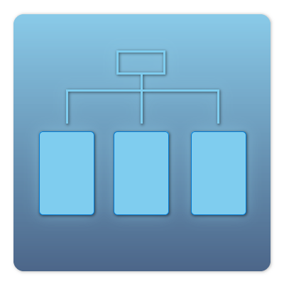
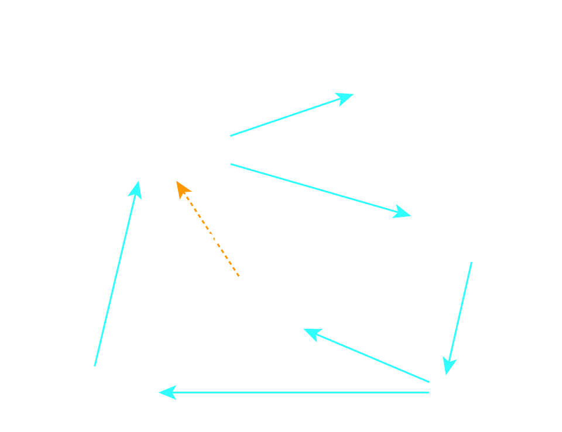
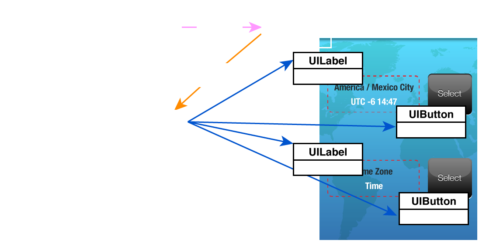
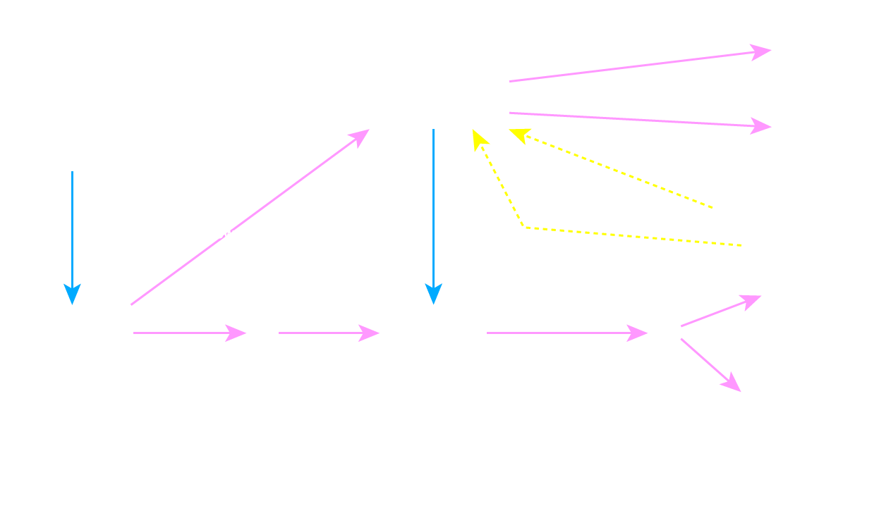
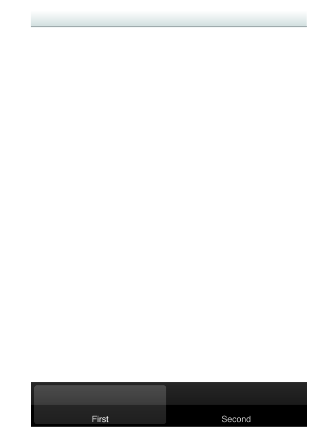
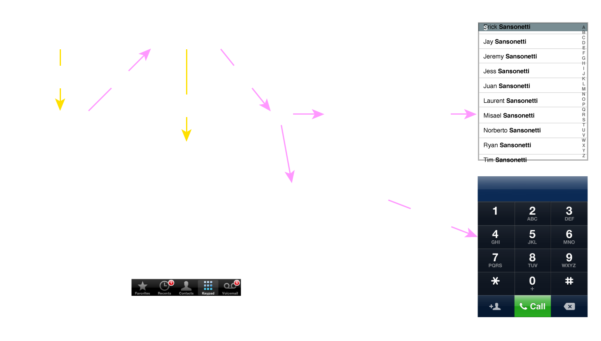
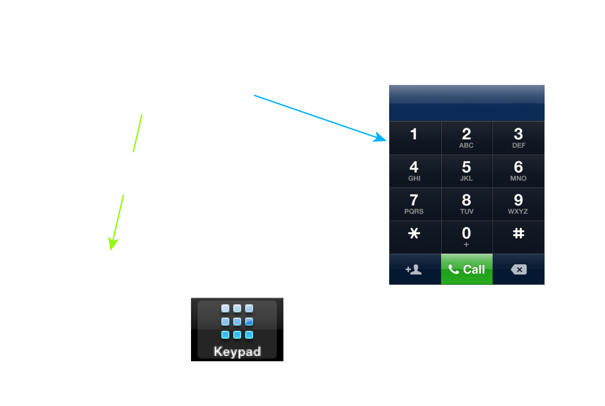

# UIViewControllers

<slide>
## UIViewControllers

 

</slide>

<slide>
## UIViewControllers

A view controller manages a set of views that make up a portion of your app’s user interface. As part of the controller layer of your app, a view controller coordinates its efforts with model objects and other controller objects—including other view controllers—so your app presents a single coherent user interface.

+ Resizes and lays out its views
+ Adjusts the contents of the views
+ Acts on behalf of the views when the user interacts with them     

</slide>
    
<slide>
## UIViewController

 

</slide>

<slide>
## view Property

Every view controller has a ***view*** property.

 

</slide>

<slide>
## Setting the View

    class MyViewController < UIViewController 
      def loadView
          self.setView(UIView.alloc.initWithFrame(screenSize))
      end
    end

</slide>

<slide>
## Object Hierarchy

 

</slide>

<slide>
## UITabBarController

 

</slide>

<slide>
## Details

 

</slide>

<slide>
## Creating a UITabBarController

    // When the application is starting...
    def application(app, didFinishLaunchingWithOptions: opts) 
        tabBarController = UITabBarController.alloc.init
        
        vc1 = ContactsController.alloc.init
        vc2 = KeypadViewController.alloc.init
        
        viewControllers = NSArray.arrayWithObjects(vc1, vc2, nil)
        tabBarController.setViewControllers(viewControllers)
     
        window.setRootViewController(tabBarController)
        window.makeKeyAndVisible

        true
    end

</slide>

<slide>
## UITabBarItem

 

</slide>

<slide>
## Configuring UITabBarItem

    def initWithNibName(nibName, bundle:bundleName)
        self = super.initWithNibName(nibName, bundle:bund)
        if (self) {
            tbi = self.tabBarItem
            tbi.setTitle("Keypad")
            
            i = UIImage.imageNamed("Keypad.png")
            tbi.setImage(i)
        }
       self
    end

</slide>

<slide>
## Appearing and Disappearing

    // Other important callbacks
    viewWillAppear(animated)
    viewDidAppear(animated)
    viewWillDisappear(animated)
    viewDidDisappear(animated)  

</slide>

<slide>
## ViewControllers

 

[Chapters](../reveal.html) | 
[DataSources](../12-DataSources/reveal.html)

</slide>

