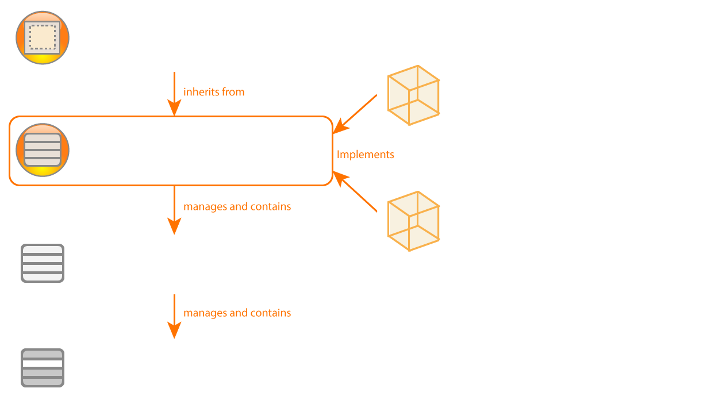
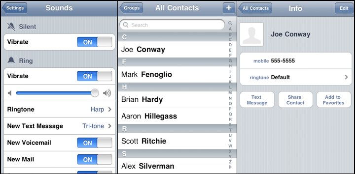
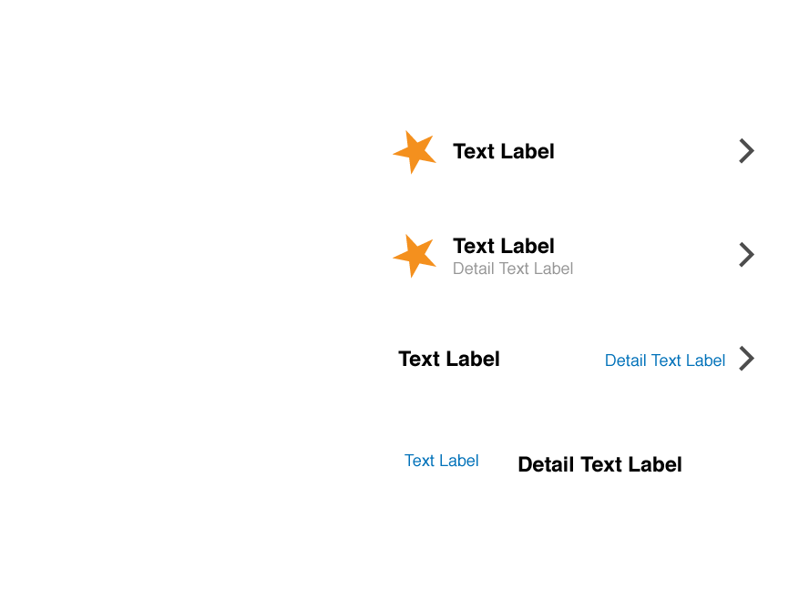
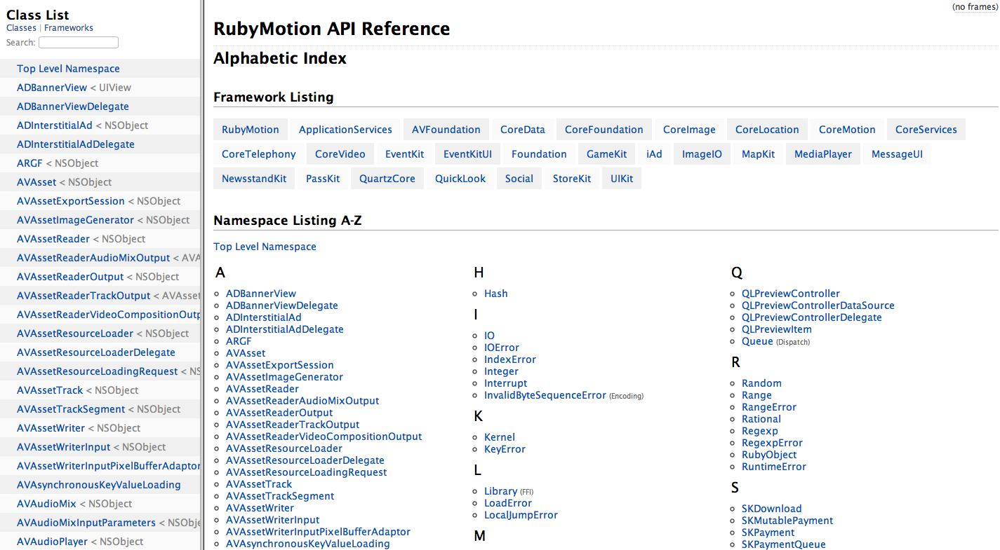
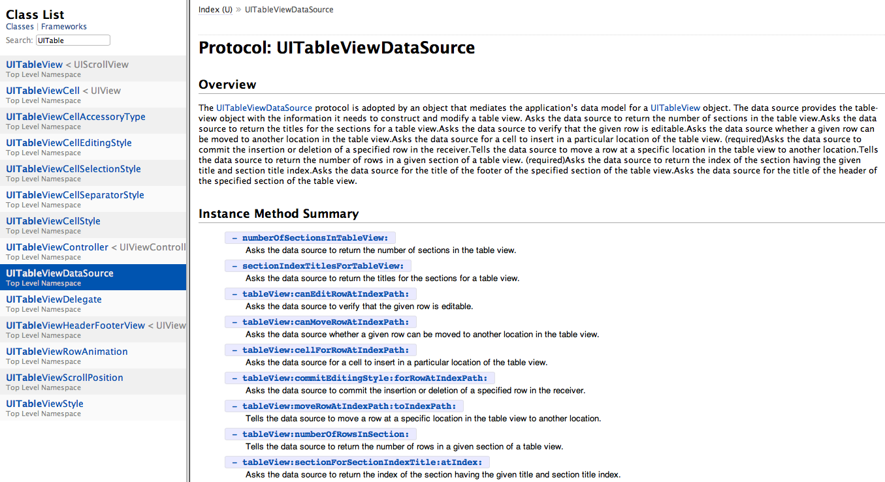

# TableViews

<slide>
## TableViews

 

</slide>

<slide>
## TableViews

The UITableViewController is a controller object that manages a table view. It implements the following behavior:

+ When the table view is about to appear the first time it’s loaded, it reloads the table view’s data.
+ When the table view has appeared, the controller flashes the table view’s scroll indicators. 
+ It implements the superclass method setEditing:animated: so that if a user taps an Edit|Done button in the navigation bar, the controller toggles the edit mode of the table.

</slide>

<slide>
## TableViews

 

</slide>

<slide>
## Plain vs Grouped

 

</slide>

<slide>
## Multiple Cells

 

</slide>

<slide>
## Datasources

A special type of delegate. It is used by the TableView in order to get the information needed to display

+ # of Rows
+ # of Sections
+ Rows

</slide>

<slide>
## Creating an UITableViewController

In the AppDelegate:

    vc = MyTableViewController.alloc.initWithStyle(UITableViewStylePlain)
    window.setRootViewController(vc)

In your TableViewController subclass:

    def loadView
        tv = UITableView.alloc.initWithStyle(UITableViewStylePlain)
        tv.setDataSource(self)
        tv.setDelegate(self)
        self.setView(tv)
    end

    def tableView(tableView, numberOfRowsInSection:section)

    end

    def tableView(tableView, cellForRowAtIndexPath:indexPath)

    end

</slide>

<slide>
## Data Retrieve Methods

    self.tableView.reloadData // When view first goes on screen        
        
    def tableView(tableView, numberOfRowsInSection:section)
        bunchOfStrings.count
    end

    def tableView(tableView, cellForRowAtIndexPath:indexPath)
      cell = UITableViewCell.alloc.initWithStyle(UITableViewCellStyleDefault, reuseIdentifier:"UITableViewCell")

      int index = indexPath.row
      someString = bunchOfStrings.objectAtIndex(index)
      cell.textLabel.setText(someString)

      cell
    end

</slide>

<slide>
## Retrieve Process

 

</slide>

<slide>
## Reuse of Cells

    def tableView(tableView, cellForRowAtIndexPath:indexPath) 
      cell = tableView.dequeueReusableCellWithIdentifier("UITableViewCell") 
      if (cell == nil) 
        cell= UITableViewCell.alloc.initWithStyle(UITableViewCellStyleDefault, reuseIdentifier:"UITableViewCell")
      end

      cell.textLabel.setText(stringList.objectAtIndex(indexPath.row)) 
        
      cell 
    end

</slide>

<slide>
## Cells Pool

 

</slide>

<slide>
## System Cell Types

 

</slide>

<slide>
## Editing UITableViews

    # Call super's implementation, do any additional UI stuff
    setEditing(flag, animated:animated)
         
    # Return YES if cell is editable
    tableView(tableView, canEditRowAtIndexPath:indexPath)
     
    # Update data source
    tableView(tableView, moveRowAtIndexPath:fromIndexPath, toIndexPath:toIndexPath)

    # Update data source        
    tableView(tableView, commitEditingStyle:editingStyle, forRowAtIndexPath:indexPath)

</slide>

<slide>
## Deleting, Moving and Inserting Rows

    def tableView(tableView, moveRowAtIndexPath:fromIndexPath, toIndexPath:toIndexPath)
      # Update our data source
      obj = array.objectAtIndex(fromIndexPath.row)
      array.removeObjectAtIndex(fromIndexPath.row)
      array.insertObject(obj, atIndex:(toIndexPath.row))
    end

    def tableView(tableView, commitEditingStyle:editingStyle, forRowAtIndexPath:indexPath)
      # Update our dataSource AND tableView
      if (editingStyle == UITableViewCellEditingStyleDelete) 
        array.removeObjectAtIndex(indexPath.row) 
        tableView.deleteRowsAtIndexPaths(NSArray.arrayWithObject(indexPath), withRowAnimation:UITableViewRowAnimationFade) 
      end
    end

</slide>

<slide>
## Rubymotion Documentation

 

</slide>

<slide>
## Protocols Documentation

 

</slide>
    
<slide>
## TableViews

 

</slide>
