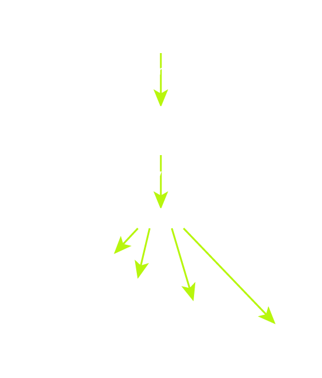
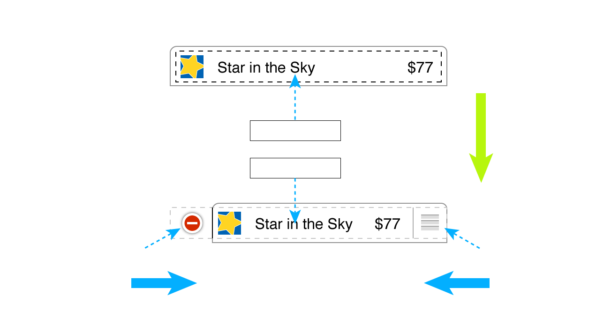

# Custome Cells

<slide>
## Custome Cells

 

</slide>

<slide>
## UITableViewCell

A UITableViewCell object includes properties and methods for managing cell selection, highlighted state, editing state and controls, accessory views, reordering controls, cell background, and content indentation. The class additionally includes properties for setting and managing cell content, specifically text and images.

</slide>

<slide>
## Cell Content

    class CocoaheadsItemCell < UITableViewCell
      attr_accessor valueLabel
      attr_accessor nameLabel
      attr_accessor imageView
    end

</slide>    

<slide>
## Cell Hierarchy

 

</slide>

<slide>
## Cell Layout

 

</slide>

<slide>
## Register NIB

    def viewDidLoad
      super.viewDidLoad
      nib = UINib.nibWithNibName("CocoaHeadsItemCell", bundle:nil)
      self.tableView.registerNib(nib, forCellReuseIdentifier:"CocoaHeadsItemCell")
    end

</slide>

<slide>
## Dequeue

    def tableView(tableView, cellForRowAtIndexPath:indexPath)
      p = RMItemStore.defaultStore.allItems.objectAtIndex(indexPath.row)

      cell = tableView.dequeueReusableCellWithIdentifier("CocoaHeadsItemCell")
      cell.nameLabel.setText(p.itemName)
      cell.serialNumberLabel.setText(p.serialNumber)
      cellvalueLabel.setText("value: " + p.valueInDollars)
      cell.thumbnailView.setImage(p.thumbnail)
    
      cell
    end
</slide>

<slide>
## Image Content

Create an offscreen image context.

    UIGraphicsBeginImageContext(CGSizeMake(70, 70))
    image.drawInRect(CGRectMake(0, 0, 70, 70))
    thumbnail = UIGraphicsGetImageFromCurrentImageContext()
    UIGraphicsEndImageContext()

</slide>

<slide>
## Custome Cells

 

</slide>
