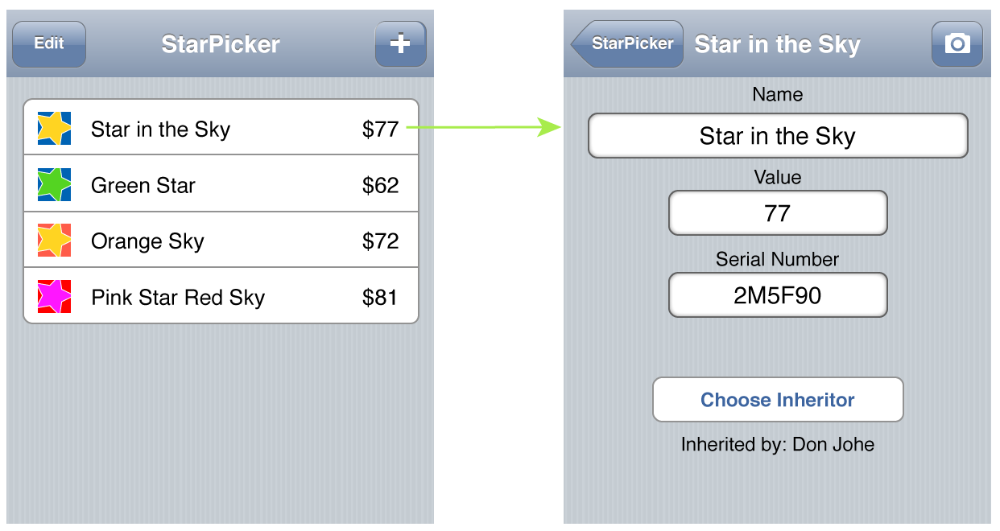

# Navigation Controllers

<slide>
## Navigation Controllers

 

</slide>

<slide>
## Navigation Controllers

Navigation Controllers allows us to animate a view controller on to the screen that shows us more detailed information about a selection on the previous screen and then allow the user to jump back to the previous one.

</slide>

<slide>
## Navigation Controllers

 

</slide>

<slide>
## UINavigationController

 

</slide>    

<slide>
## Creating a Navigation Controller
  
    # In your AppDelegate
    def application(app, didFinishLaunchingWithOptions:options)
      rootVC = MyViewController.alloc.init
      navController = UINavigationController.alloc.initWithRootViewController(rootVC)

      window.setRootViewController(navController)
      window.makeKeyAndVisible
      
      true
    end

</slide>  

<slide>
## Pushing a ViewController

    class MyViewController

      def drillDown
        detailVC = DetailViewController.alloc.init
        
        self.navigationController.pushViewController(detailVC, animated:true)
      end
    end

</slide>  

<slide>
## Contrast with UITabBarController
UITabBarController

    - A LIST of UIViewControllers
    - List is typically static
    - Has a UITabBar with access to all VCs

UINavigationController

    - A STACK of UIViewControllers
    - List is dynamic
    - UINavigationBar with access to previous VC

viewWillAppear/viewWillDisappear work the same

</slide>

<slide>
## Navigation Controllers

 

[Chapters](../reveal.html) | 
[Notifications](../15-Notifications/reveal.html)

</slide>
