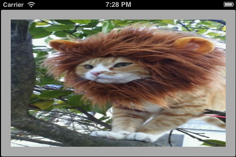
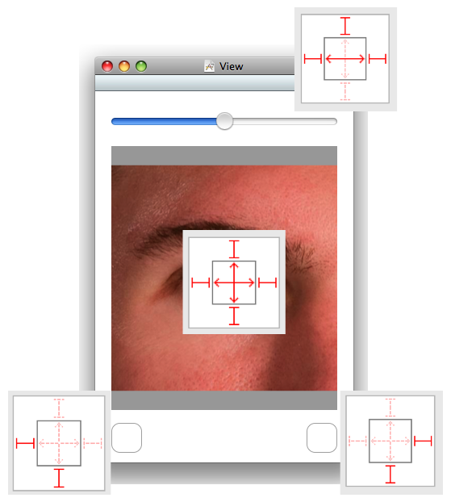

# Notifications

<slide>
## Notifications

 

</slide>

<slide>
## Notifications

An interface that can be rotated to landscape mode/portrait mode?

 
 

</slide>

<slide>
## Becoming an Observer

    # Get hold of the notification center for the app
    nc = NSNotificationCenter.defaultCenter

    # Add yourself as an observer
    nc.addObserver:self
           selector::'fooHappened:'
               name:'FooNotification'
             object:nil)

    ...
        
    def fooHappened(aNSNotification)

    end

</slide>

<slide>
## Posting a notification
    # Get hold of the notification center for the app
    nc = NSNotificationCenter.defaultCenter
    note = NSNotification.notificationWithName('FooNotification', object:self, userInfo:aDictionary)
    nc.postNotification(note)

</slide>

<slide>
## Autorotation in View Controller
    def shouldAutorotateToInterfaceOrientation(aUIInterfaceOrientation) 
        return aUIInterfaceOrientation == UIInterfaceOrientationPortrait
    end

Other Options

    UIInterfaceOrientationPortrait           
    UIInterfaceOrientationPortraitUpsideDown 
    UIInterfaceOrientationLandscapeLeft      
    UIInterfaceOrientationLandscapeRight     

    UIInterfaceOrientationMaskPortrait
    UIInterfaceOrientationMaskLandscapeLeft
    UIInterfaceOrientationMaskLandscapeRight
    UIInterfaceOrientationMaskPortraitUpsideDown
    UIInterfaceOrientationMaskLandscape
    UIInterfaceOrientationMaskAll
    UIInterfaceOrientationMaskAllButUpsideDown

</slide>

<slide>
## Springs and Struts

 

</slide>

<slide>
## Notifications

 

</slide>
