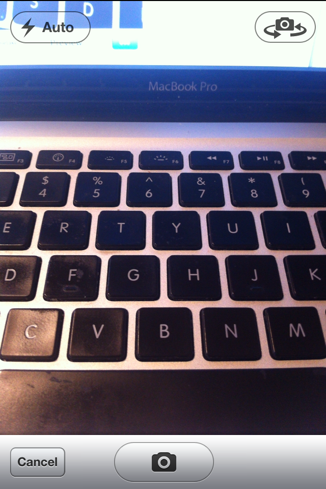
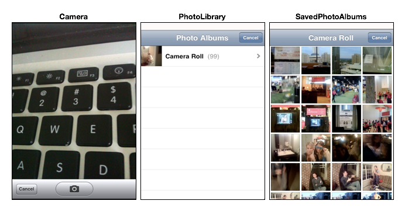

# Camera

<slide>
## Camera

 

</slide>

<slide>
## Camera

Getting images from the camera or the user's photo library.

 

</slide>
    
<slide>
## UIImagePickerController

    class MyViewController
      def takePictureWithCamera

        imagePicker = UIImagePickerController.alloc.init
        
        imagePicker.setSourceType(UIImagePickerControllerSourceTypeCamera)
        imagePicker.setDelegate(self)
        
        self.presentViewController(imagePicker, animated:true completion:nil)
      end
    end

</slide>

<slide>
## Source Types

 

</slide>

<slide>
## How do I get the image?

    # In your delegate controller
    def imagePickerController(picker, didFinishPickingMediaWithInfo:info)

      img = info.objectForKey(UIImagePickerControllerOriginalImage)

      self.doSomethingWithImage(img)    
      self.dismissViewControllerAnimated(true, completion:nil)
    end

</slide>

<slide>
## Camera

 

[Chapters](../reveal.html) | 
[File System](../18-Filesystem/reveal.html)

</slide>
