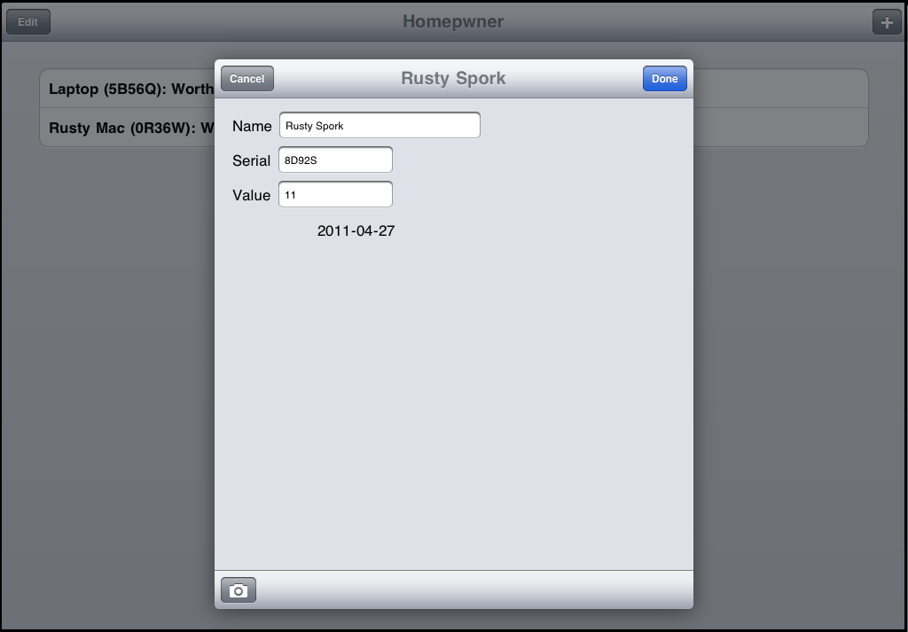

# Camera

<slide>
## Camera

 

</slide>

<slide>
## Camera

Getting images from the camera or the user's photo library.

 

</slide>
    
<slide>
## UIImagePickerController

    class MyViewController
      def takePictureWithCamera

        imagePicker = UIImagePickerController.alloc.init
        
        imagePicker.setSourceType(UIImagePickerControllerSourceTypeCamera)
        imagePicker.setDelegate(self)
        
        self.presentViewController(imagePicker, animated:true completion:nil)
      end
    end

</slide>

<slide>
## Source Types

 

</slide>

<slide>
## How do I get the image?

    # In your delegate controller
    def imagePickerController(picker, didFinishPickingMediaWithInfo:info)

      img = info.objectForKey(UIImagePickerControllerOriginalImage)

      self.doSomethingWithImage(img)    
      self.dismissViewControllerAnimated(true, completion:nil)
    end

</slide>

<slide>
## Popover and Modal View Controllers

For iPad we have another controller to manage Master/Detail configurations

    # In your controller
    if (UIDevice.currentDevice.userInterfaceIdiom == UIUserInterfaceIdiomPad)

      # Create a new popover controller that will display the imagePicker
      pc = UIPopoverController.alloc.initWithContentViewController(vc)
      pc.setDelegate(self)

      pc.presentPopoverFromBarButtonItem(bbi, permittedArrowDirections:UIPopoverArrowDirectionAny, animated:true)

    else

      self.presentViewController(vc, animated:true completion:nil)

    end
    
</slide>

<slide>
## Popover delegate
    
    # In your delegate
    def popoverControllerDidDismissPopover(popoverController)

      puts 'User dismissed popover'
      pc = nil

    end
    
</slide>

<slide>
## Dismissal
    
    # In your delegate
    if(UIDevice.currentDevice.userInterfaceIdiom == UIUserInterfaceIdiomPhone)

      self.dismissViewControllerAnimated(true, completion:nil)

    else    

      pc.dismissPopoverAnimated(true)
      pc = nil

    end
    
</slide>

<slide>
## Presentation styles
    
Another configuration options

    viewController.setModalPresentationStyle(UIModalPresentationFormSheet)
    viewController.setModalTransitionStyle(UIModalTransitionStyleFlipHorizontal)
    
</slide>

<slide>
## Form Style

 

</slide>

<slide>
## Using Blocks 
    
    vc.dismissViewControllerAnimated(true, completion:lambda do
      puts 'VC got dismissed!'
    end)
    
</slide>

<slide>
## Camera

 

[Chapters](../reveal.html) | 
[File System](../18-Filesystem/reveal.html)

</slide>
