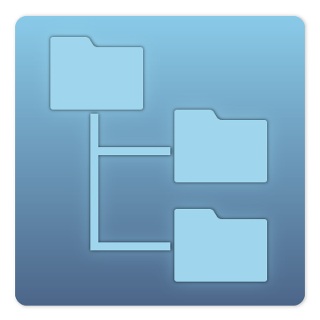
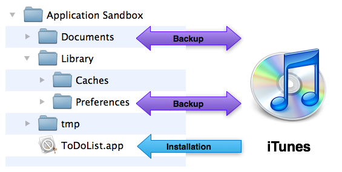

# File System

<slide>
## File System

 

</slide>

<slide>
## Application Sandbox

 

</slide>

<slide>
## Locating the Documents Directory

    paths = NSSearchPathForDirectoriesInDomains(NSDocumentDirectory, # Which directory you want?
             NSUserDomainMask, # Always NSUserDomainMask
             true) # Always true
    documentsDirectory = paths.objectAtIndex(0)

    sandbox = NSHomeDirectory()

</slide>

<slide>
## What do I write/read?

iOS has methods to save string or binary data:

<b>NSData</b>

      writeToFile(path, atomically:flag

      initWithContentsOfFile(path)

<b>NSString</b>

    writeToFile(path, atomically:useAuxiliaryFile, encoding:enc, error:error)

    initWithContentsOfFile(path, encoding:enc, error:error)

</slide>

<slide>
## Property Lists
<b>NSData, NSString, NSDate, NSNumber, NSArray, NSDictionary</b> are all <i>property list serializable</i>. Can read/write populated <b>NSArray</b> or <b>NSDictionary</b> to disk and read them back in, as long as they only contain plist objects.

    allGroups = NSMutableArray.array
    workGroup = NSMutableDictionary.dictionary
    allGroups.addObject(workGroup)
    
    bossContact = NSMutableDictionary.dictionary
    bossContact.setObject('Laurent Sansonetti', forKey:'Name')
    bossContact.setObject(5555555, forKey:'Number')
    workGroup.setObject(bossContact, forKey:'Boss')
    
    allGroups.writeToFile('/path/to/doc/directory', atomically:true)

    allGroups = NSMutableArray.alloc.initWithContentsOfFile('/path/to/doc/directory')

</slide>

<slide>
## Conforming to NSCoding

    class RMItem
      def encodeWithCoder(coder)
        # possessionName and dateCreated must conform to NSCoding!
        coder.encodeObject(itemName, forKey:'itemName')
        coder.encodeObject(dateCreated, forKey:'dateCreated')

        coder.encodeInteger(valueInDollars, forKey:'valueInDollars')
      end

      def initWithCoder(coder)
        if (self = super.init)
          itemName = coder.decodeObjectForKey('itemName')
          dateCreated = coder.decodeObjectForKey('dateCreated')
          valueInDollars = coder.decodeIntegerForKey('valueInDollars')
        end
        
        self
      end
    end

</lide>

<slide>
## NSKeyedArchiver and NSKeyedUnarchiver

    singlePath = '/path/to/item'

    success = NSKeyedArchiver archiveRootObject:anObject toFile:singlePath];
    i = NSKeyedUnarchiver.unarchiveObjectWithFile(singlePath)
        
    array = NSArray.arrayWithObject(i)

    success = NSKeyedArchiver.archiveRootObject(array, toFile:somePath)

    arrayFromDisk = NSKeyedUnarchiver.unarchiveObjectWithFile(somePath)

</slide>

<slide>
## When to save

    # iOS 4.0 and greater
    def applicationDidEnterBackground(application)

        RBItemStore.store.save

    end

</slide>

<slide>
## File System

 

[Chapters](../reveal.html) | 
[Multitouch](../19-Multitouch/reveal.html)

</slide>
