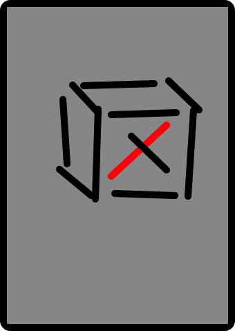

# Multitouch

<slide>
## Multitouch

 

</slide>

<slide>
## Touches
Handling touches and performing some action based on theim.

</slide>

<slide>
## UIResponder

UIViews are also UIResponders

    touchesBegan(touches, withEvent:event)

    touchesMoved(touches, withEvent:event)

    touchesEnded(touches, withEvent:event)

    touchesCancelled(touches, withEvent:event)

</slide>

<slide>
## UITouch and NSSet
IOS uses NSSets to represent group of touches. They are unordered.

    def touchesBegan(touches, withEvent:event)
        aTouch = touches.anyObject
        touches do |touch|
            # process the touches.
        end
    end

UITouch has all information for one finger

    tapCount

    locationInView(view)

    previousLocationInView(view)

    timeStamp

</slide>

<slide>
## Using UITouch
One touch object recycled for lifetime of a touch

    # Delegate method
    def touchesBegan(touches, withEvent:event)

        touches.do |touch|
            key = NSValue.valueWithPointer(touch)
            startLocation = touch.locationInView(self)
        
            v = NSValue.valueWithCGPoint(startLocation)
        
            touchDict.setObject(v, forKey:key)
        end
    end

</slide>

<slide>
## Using UITouch
Processing touches

    # Delegate method
    def touchesEnded(touches, withEvent:event)

        touches.do |touch|
            key = NSValue.valueWithPointer(t)
            endLocation = t.locationInView(self)
            startLocation = touchDict.objectForKey(key).CGPointValue)
        
            delta = CGPointMake(endLocation.x - startLocation.x, endLocation.y - startLocation.y)

            touchDict.removeObjectForKey(key)
        end
    end

</slide>

<slide>
## The Responder Chain

</slide>

<slide>
## Gesture Recognizers

    UITapGestureRecognizer

    UILongPressGestureRecognizer

    UIPanGestureRecognizer

    UIPinchGestureRecognizer

    UISwipeGestureRecognizer

    UIRotationGestureRecognizer

</slide>

<slide>
## Attached to a View

    gr = UITapGestureRecognizer.alloc.initWithTarget(self, action: :'tap:')

    view.addGestureRecognizer(gr)
    
</slide>

<slide>
## Action method
    
    def tap(aUITapGestureRecognizer)

        state = aUITapGestureRecognizer.state
        
        if (state == UIGestureRecognizerStateBegan)
        elsif (state == UIGestureRecognizerStateChanged)
        elsif (state == UIGestureRecognizerStateEnded)
        elsif (state == UIGestureRecognizerStateRecognized)
        elsif (state == UIGestureRecognizerStateCancelled)
        end
    end
    
</slide>

<slide>
## UIMenuController

 

</slide>

<slide>
## UIMenuController

    menu = UIMenuController.sharedMenuController

    mi = UIMenuItem.alloc.initWithTitle('Delete', action: :'delete:')
                                                
    menu.setMenuItems(NSArray.arrayWithObject(mi))
    menu.setTargetRect(someRect, inView:view)

    view.becomeFirstResponder
    menu.setMenuVisible(true, animated:true)
    
</slide>
    
<slide>
## Multitouch

 

</slide>
