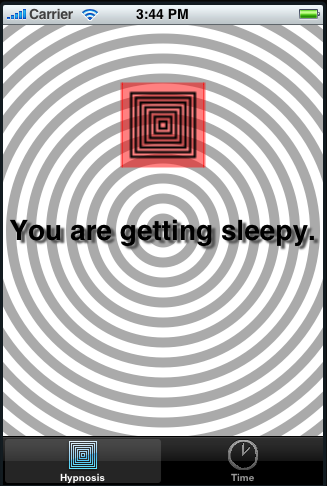

# CALayers

<slide>
## CALayers

 

</slide>

<slide>
## CALayer

 

</slide>

<slide>
## Layers are Hierarchical

 

</slide>

<slide>
## Explicitly Creating a CALayer

    # Create the new layer object 
    aLayer = CALayer.alloc.init 

    # Give it a size 
    aLayer.setBounds(CGRectMake(0, 0, 85, 85))

    # Give it a location 
    aLayer.setPosition(CGPointMake(160, 100))
            
    # Make it a sublayer of the view's layer 
    aView.layer.addSublayer(aLayer)

</slide>

<slide>
## Drawing on a Layer

    aLayer.setDelegate(self)

    def drawLayer(layer, inContext:ctx)
      ...drawing with Core Graphics...
    end

</slide>

<slide>
## Other Properties

    contents # CGImageRef, typically
    contentsRect
    contentsGravity

    backgroundColor;

</slide>
    
<slide>
## CALayers

 

[Chapters](../reveal.html) | 
[CoreAnimation](../21-CoreAnimation/reveal.html)

</slide>
