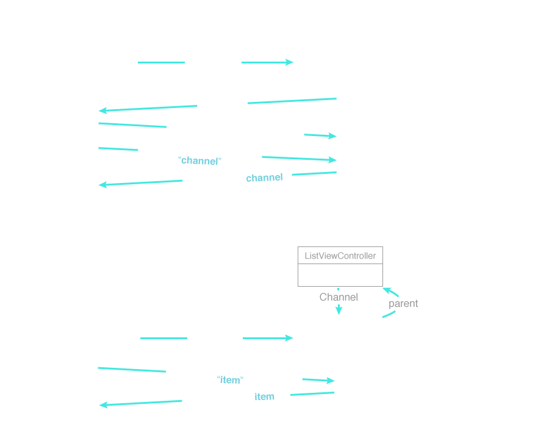
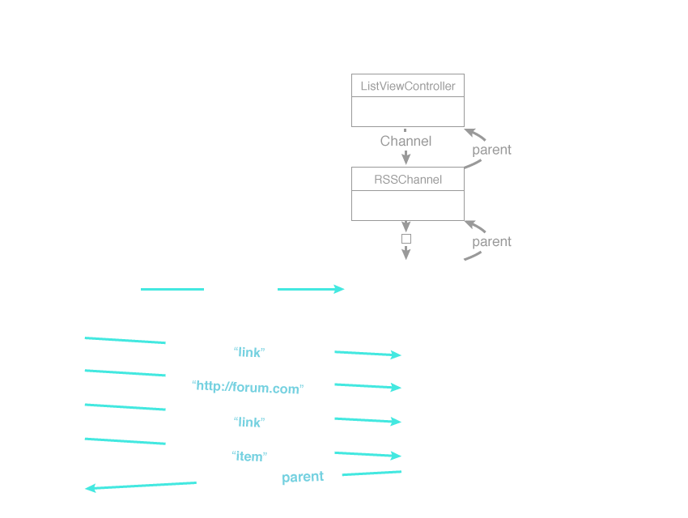
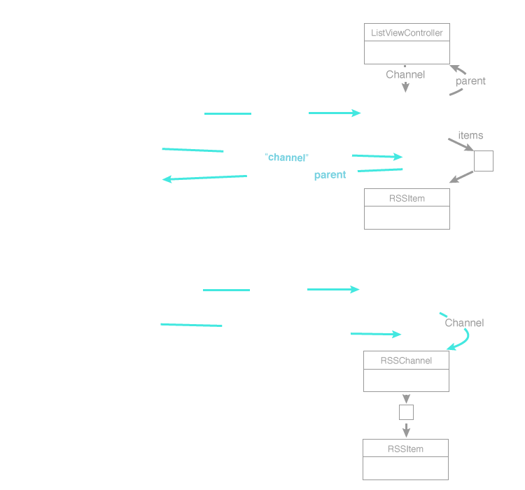

# WebServices

<slide>
## WebServices

 

</slide>

<slide>
## Web Services

 

</slide>

<slide>
## Synchronous URL Fetch

    url = NSURL.URLWithString('http://www.rubymotion.com')
    urlRequest = 
        NSURLRequest.requestWithURL(url,
                         cachePolicy:NSURLRequestReturnCacheDataElseLoad,
                     timeoutInterval:30)
        
    response = nil
    error = nil;
    urlData = NSURLConnection.sendSynchronousRequest(urlRequest,
                                    returningResponse:&response,
                                                error:&error)

</slide>

<slide>
## Asynchronous URL Fetch
    url = NSURL.URLWithString('http://www.bignerdranch.com')
    request = 
        NSURLRequest.requestWithURL(url,
                         cachePolicy:NSURLRequestReloadIgnoringCacheData,
                     timeoutInterval:30)

    urlData = NSMutableData.alloc.init

    c = NSURLConnection.alloc.initWithRequest(request,
                                              delegate:self,
                                            startImmediately:true)

    def connection(con, didFailWithError:er)
    end

    def connectionDidFinishLoading(con)
    end

    def connection(con, didReceiveData:data)
    end

</slide>

<slide>
## Collecting data

    def connection(con, didReceiveData:data)
        urlData.appendData(data)
    end

    def connectionDidFinishLoading(con)
        # urlData is now complete
        # do something with urlData
    end
    
</slide>

<slide>
## NSXMLParser
 
Only event-based parser on the iPhone, no tree-based parsers.

    error = nil
    parser = NSXMLParser.alloc.initWithData(urlData, options:0, error:&error)
    parser.setDelegate(theDelegate)                                    

    parser.parse 

</slide>
<slide>
## NSXMLParser Delegates
File

    <xml version="1.0" encoding="UTF-8">
    <person>
      <first>Larry</first>
      <last>Furg</last>
    </person>

Code

    parser(p, didStartElement:elementName, namespaceURI:uri, qualifiedName:qualifiedName, attributes:attributeDict)

    parser(p, foundCharacters:string)

    parser(p, didEndElement:elementName, namespaceURI:namespaceURI, qualifiedName:qName)

</slide>
    
<slide>
## Parsing

 

</slide>

<slide>
## Parsing

 

</slide>

<slide>
## Parsing

 

</slide>

<slide>
## WebServices

 

[Chapters](../reveal.html) | 
[CoreData](../24-CoreData/reveal.html)

</slide>
